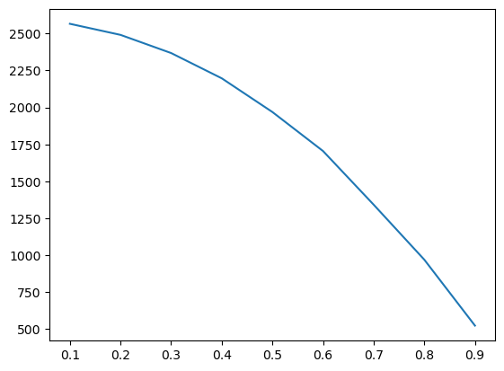

# Введение

Мы работаем в сервисе доставке еды. Наша команда разработала новую программу лояльности и хочет проверить лучше ли она старой. В качестве метода проверки был выбран АБ-тест. <br>

### Цель работы <br>
Спроектировать дизайн этого теста: сформулировать гипотезы, корректно разбить пользоваетлей на группы, <br> 
определить достаточный размер выборок, необходимые статистические методы, а также проверить корректность работы этого всего на синтетических тестах

# Содержание:
1. [Подготовка](#1)
    1. [Выбор метрики](#1_1)
    1. [Формулировка гипотезы](#1_2)
    1. [Выгрузка данных](#1_3)
1. [Дизайн теста](#2)
    1. [Система сплитования](#2_1)
    1. [Размер выборки](#2_2)
    1. [АА-тест](#2_3)
    1. [АБ-тест](#2_4)
    1. [Cuped](#2_5)
1. [Итоги](#3)


# 1. Подготовка эксперимента <a class="anchor" id="1"></a>

## Выбор метрики <a class="anchor" id="1_1"></a>

В качестве целевой метрики был выбран средний чек, так как логично предположить, что программа лояльности на него напрямую влияет <br>

Также во время эксперимента важно мониторить показатели дополнительных метрик, для нас, например, это может быть среднее количество заказов в день, так как нам также важно чтобы это метрика сильно не проседала

## Формулировка гипотезы <a class="anchor" id="1_2"></a>

Компания решила, что минимальный результат, который будет стоить внедрения, должен составить 3%, соответсвенно при таком минимальном обнаруживаемом эффекте будут выдвинуты следующие гипотезы <br>
Нулевая гипотеза: программы не отличаются и наблюдаемые различия случайны <br>
Альтернативная гипотеза: программы отличаются <br>
Тест будет двусторонним, чтобы отследить изменения в обе стороны. <br>
Уровень значимости значимости составит 5%, а мощность 80% <br>


## Данные <a class="anchor" id="1_3"></a>

Импортируем все необходимые библиотеки и методы


```python
import pandas as pd
import numpy as np
import seaborn as sns
import matplotlib.pyplot as plt
import scipy.stats as sps
from scipy import linalg
import hashlib
from tqdm import tqdm
```


```python
df = pd.read_csv('orders_data.csv') # загрузим датасет с данными по заказам за последние 2 недели
df.head()
```


<div>
<style scoped>
    .dataframe tbody tr th:only-of-type {
        vertical-align: middle;
    }

    .dataframe tbody tr th {
        vertical-align: top;
    }

    .dataframe thead th {
        text-align: right;
    }
</style>
<table border="1" class="dataframe">
  <thead>
    <tr style="text-align: right;">
      <th></th>
      <th>order_id</th>
      <th>customer_id</th>
      <th>restaurant_name</th>
      <th>cuisine_type</th>
      <th>cost_of_the_order</th>
      <th>day_of_the_week</th>
      <th>rating</th>
      <th>food_preparation_time</th>
      <th>delivery_time</th>
    </tr>
  </thead>
  <tbody>
    <tr>
      <th>0</th>
      <td>1478445</td>
      <td>129092</td>
      <td>The Meatball Shop</td>
      <td>Chinese</td>
      <td>32.800610</td>
      <td>Weekend</td>
      <td>5</td>
      <td>22</td>
      <td>23</td>
    </tr>
    <tr>
      <th>1</th>
      <td>1478446</td>
      <td>373255</td>
      <td>Blue Ribbon Fried Chicken</td>
      <td>Mediterranean</td>
      <td>16.695462</td>
      <td>Weekday</td>
      <td>3</td>
      <td>35</td>
      <td>15</td>
    </tr>
    <tr>
      <th>2</th>
      <td>1478447</td>
      <td>302790</td>
      <td>Blue Ribbon Sushi</td>
      <td>Japanese</td>
      <td>14.520490</td>
      <td>Weekday</td>
      <td>5</td>
      <td>25</td>
      <td>27</td>
    </tr>
    <tr>
      <th>3</th>
      <td>1478448</td>
      <td>138024</td>
      <td>RedFarm Broadway</td>
      <td>American</td>
      <td>18.058331</td>
      <td>Weekend</td>
      <td>Not given</td>
      <td>27</td>
      <td>26</td>
    </tr>
    <tr>
      <th>4</th>
      <td>1478449</td>
      <td>384360</td>
      <td>J. G. Melon</td>
      <td>American</td>
      <td>14.972527</td>
      <td>Weekday</td>
      <td>4</td>
      <td>25</td>
      <td>28</td>
    </tr>
  </tbody>
</table>
</div>


```python
df.shape
```


    (10000, 9)


Посчитаем ежедневное количество заказов, чтобы в конце определить примерную продолжительность АБ теста


```python
daily_orders = round(df.shape[0]/14)
daily_orders 
```


    714


Посмотрим текущее значение среднего чека


```python
df.cost_of_the_order.mean()
```


    21.04220907594812


Построим гистограмму его распределения


```python
df.cost_of_the_order.hist()
```


    <AxesSubplot:>


    

    


# 2. Дизайн теста <a class="anchor" id="2"></a>

## Система сплитования <a class="anchor" id="2_1"></a>

Сделаем систему сплитования с помощью хэширования с солью, пользователи с четным хэшом будут в контрольной группе, с нечетным во второй


```python
def split(id, salt='ab_test', n_groups=2 ):
    test_id = str(id) + '-' + str(salt) # добавляем к id соль
    return hash(test_id)%n_groups # делаем хэш и берем остаток от деления
```


```python
df['group'] = df.customer_id.apply(split)
```


```python
df.group.value_counts()

```


    1    5006
    0    4994
    Name: group, dtype: int64


Распределяет более-менее равномерно


```python
df[df.group==1].cost_of_the_order.mean(),df[df.group==0].cost_of_the_order.mean()
```


    (21.233958526541766, 20.849998873771465)


Средние также примерно равны

## Расчет минимального размера выборки <a class="anchor" id="2_2"></a>

Вычисления будут проводиться по следующей формуле:

$$n > \dfrac{\left[ \Phi^{-1} \Bigl( 1-\dfrac{\alpha}{2} \Bigr) + \Phi^{-1} \Bigl( 1-\beta \Bigr) \right]^2 (\sigma_A^2 + \sigma_B^2)}{\varepsilon^2}$$

Где: <br>
n - размер выборки <br>
$\sigma$ - сигма соответствующей выборки <br>
$\varepsilon$ - минимальный эффект <br>
$\alpha$ - вероятность ошибки первого рода <br>
$\beta$ - вероятность ошибки второго рода <br>
$\Phi^{-1} ()$- соответствующий квантиль нормального распределения <br>


```python

def get_sample_size(e, std, alpha=0.05, beta=0.2):
    z_alpha = sps.norm.ppf(1 - alpha / 2, loc=0, scale=1) # считаем квантили
    z_beta = sps.norm.ppf(1 - beta, loc=0, scale=1)
    square = (z_alpha + z_beta) ** 2 
    sample_size = int(
        np.ceil(
            square * (2 * std ** 2) / (e ** 2) # будем считать что дисперсии выборок одинаковые
        )
    )
    return sample_size
```

Также из этой формулы выведем mde


```python

def get_mde(sample_size, std, alpha=0.05, beta=0.2):
    z_alpha = sps.norm.ppf(1 - alpha / 2, loc=0, scale=1)
    z_beta = sps.norm.ppf(1 - beta, loc=0, scale=1)
    disp_sum_sqrt = (2 * (std ** 2)) ** 0.5
    mde = (z_alpha + z_beta) * disp_sum_sqrt / np.sqrt(sample_size)
    return mde
```

Посчитаем необходимый нам размер 


```python
metric = df.cost_of_the_order.mean() # метрика
std = df.cost_of_the_order.std() # сигма метрики
effect = metric*0.03 # наш минимальный эффект
sample_size = get_sample_size(effect,std)
sample_size
```


    2583


## AA-тест <a class="anchor" id="2_3"></a>

Чтобы проверить насколько корректно работает сплитование и расчет выборки проведем AA тесты. В качестве статистического метода будет использовать обычный t-тест


```python
salt = '-experiment'
count = 1000
results_AA = [0 for _ in range(count)]
for i in tqdm(range(count)):
    sample = df.sample(2*sample_size) # берем необходимый сэмпл из выборки
    sample['group'] = sample.customer_id.apply(split, salt = str(i)+salt) # разделяем пользователей с новой солью
    a1 = sample[sample.group == 0].cost_of_the_order # берем знаения метрики из первой и второй группы
    a2 = sample[sample.group == 1 ].cost_of_the_order 
    _, p = sps.ttest_ind(a1, a2) 
    results_AA[i] = p
sns.ecdfplot(results_AA).plot([0,1],[0,1], 'k--')
```

      5%|████▏                                                                           | 53/1000 [00:04<01:00, 15.68it/s]100%|██████████████████████████████████████████████████████████████████████████████| 1000/1000 [00:42<00:00, 23.74it/s]
    


    [<matplotlib.lines.Line2D at 0x2eb11233f70>]


    

    


Pvalue распределен довольно равномерно, посмотрим какая получилась альфа


```python
sum([i<0.05 for i in results_AA])/1000 # Суммируем все значения pvalue<0.05 и делим на общеее количество
```


    0.052


На ожидаемом уровне, посмотрим как это повлияет на АБ-тесты

## AB тест <a class="anchor" id="2_4"></a>


```python
mu = df.cost_of_the_order.mean()
std = df.cost_of_the_order.std()
mde = mu*0.03
sample_size = get_sample_size(mde,std)
count = 1000
results_AB = [0 for _ in range(count)]
for i in tqdm(range(count)):
    sample = df.sample(2*sample_size)
    sample['group'] = sample.customer_id.apply(split, salt = str(i)+salt)
    a = sample[sample.group == 0].cost_of_the_order
    b = sample[sample.group == 1].cost_of_the_order
    b+=mde
    _, p = sps.ttest_ind(a, b)
    results_AB[i] = p
sns.ecdfplot(results_AB).plot([0,1],[0,1], 'k--')
```

      2%|█▎                                                                              | 16/1000 [00:00<00:35, 27.73it/s]100%|██████████████████████████████████████████████████████████████████████████████| 1000/1000 [00:37<00:00, 26.78it/s]
    


    [<matplotlib.lines.Line2D at 0x2eb12ae9be0>]


    

    


```python
sum([i<0.05 for i in results_AB])/1000
```


    0.803


Все хорошо, мощность на ожидаемом уровне, значит все работает корректно

Проводить тест мы будем неделю, чтобы избежать сезонных искажений. Соответственно, итоговый размер каждой выборки составит примерно


```python
daily_orders*7/2
```


    2499.0


```python
sample_size # размер выборки, который посчитала функция
```


    2583


Совсем немного не хватает, но это не критично, так как мы можем использовать техники понижения дисперсии метрики, чтобы увеличить мощность и/или понизить необходимое количество наблюдений, сейчас одну из них и разберем

## Cuped <a class="anchor" id="2_5"></a>

Эта техника основана на использовании дополнительной метрики, которая коррелирует с главной. <br>
Для этого нам нужно сделать преобразование нашей метрики по формуле:

$$\hat{Y}_{CUPED} = \overline{Y} - \theta \overline{X} + \theta\mathbb{E}X$$

X - метрика коррелирующая с ключевой <br>
$\theta$ - специальный параметр, при котором дисперсия cuped метрики достигает минимальных значений

Формула для оптимального значения $\theta$:

$$\theta = \frac{\mathrm{cov}(Y,X)}{\mathbb{V} X}$$

Чтобы получить показатель, коррелирующий с ключевой метрикой, можно, например, взять ту же ключевую метрику двухнедельной давности. <br> 
Но сейчас я для примера ее просто сгенерирую


```python
def generate_data(df,corr=0.6):
    x = df.cost_of_the_order
    y = df.sample(df.cost_of_the_order.count(),  # берем сэмпл данных из оригинальной выборки и немного рандомизируем
                   replace=True).cost_of_the_order+np.random.normal(0,2, size = df.cost_of_the_order.count())
    y = y.to_list()
    x = [[x[i],y[i]] for i in range(len(x))] # создаем одну матрицу с двумя столбцами
    corr_mat = np.array([ # создаем матрицу с нужной корреляцией
        [1.0, corr],
        [corr, 1.0]]) 
    upper_chol = linalg.cholesky(corr_mat) # применяем разложение Холецкого
    y = np.dot(x, upper_chol) # считаем скалярное произведение полученных матриц
    df['cost_of_the_order'] = [i[0] for i in y] # помещаем значение каждой переменной в датафрейм
    df['covar'] = [i[1] for i in y]
    return df
```


```python
df_new = generate_data(df,corr=0.5)
```


```python
df_new[['cost_of_the_order','covar']].corr()
```


<div>
<style scoped>
    .dataframe tbody tr th:only-of-type {
        vertical-align: middle;
    }

    .dataframe tbody tr th {
        vertical-align: top;
    }

    .dataframe thead th {
        text-align: right;
    }
</style>
<table border="1" class="dataframe">
  <thead>
    <tr style="text-align: right;">
      <th></th>
      <th>cost_of_the_order</th>
      <th>covar</th>
    </tr>
  </thead>
  <tbody>
    <tr>
      <th>cost_of_the_order</th>
      <td>1.000000</td>
      <td>0.482348</td>
    </tr>
    <tr>
      <th>covar</th>
      <td>0.482348</td>
      <td>1.000000</td>
    </tr>
  </tbody>
</table>
</div>


Работает, отлично <br>
Теперь напишем функции, которые по формулам будут считать cuped-метрики


```python
# Функцию которая нам будем сразу по формуле выводить значение theta
def get_theta(y_control, y_test, x_control, x_test):
    y = np.hstack([y_control, y_test])
    x = np.hstack([x_control, x_test])
    covariance = np.cov(x, y)[0, 1] # cчитаем ковариацию
    variance = x.var() # cчитаем дисперсию ковариаты
    theta = covariance / variance
    return theta

# Функцию которая автоматически будем проводить t-тест и выдавать pvalue
def check_test(df_control, df_test, metric): 
    values_control = df_control[metric].values
    values_test = df_test[metric].values
    _, pvalue = sps.ttest_ind(values_control, values_test)
    return pvalue

# Функция считает cuped метрики и проводит t-тест
def check_cuped_test(df_control, df_test,metric, metric_before):
    theta = get_theta(
        df_control[metric], df_test[metric],
        df_control[metric_before], df_test[metric_before]
    )
    # посчитаем по формуле значение cuped метрик в контроле и в тесте
    metric_cuped_control = df_control[metric] - theta * df_control[metric_before]
    metric_cuped_test = df_test[metric] - theta * df_test[metric_before]
    _, pvalue = sps.ttest_ind(metric_cuped_control, metric_cuped_test)
    return pvalue

```

Посмотрим как это работает на практике. Начнем c АА теста


```python
corr = 0.7 # задаем корреляцию
df_new = generate_data(df,corr=0.7) # генерим данные
mu = df_new.cost_of_the_order.mean() # считаем среднее и сигму получившихся значений
std = df_new.cost_of_the_order.std() 

sample_size = get_sample_size(mde,std) # находим размер выборки
count = 1000

# Создадим массивы куда будем заносить получившиеся pvalue
pvalues = [0 for i in range(count)]
pvalues_cuped = [0 for i in range(count)]
for i in tqdm(range(count)):
    sample = df.sample(2*sample_size).copy()
    sample['group'] = sample.customer_id.apply(split, salt = str(i)+salt)
    a1 = sample[sample.group == 0]
    a2 = sample[sample.group == 1 ]
    pvalue = check_test(a1,a2,'cost_of_the_order')
    pvalue_cuped = check_cuped_test(a1,a2,'cost_of_the_order','covar')
    pvalues[i] = pvalue
    pvalues_cuped[i] = pvalue_cuped
```

      3%|██▌                                                                             | 32/1000 [00:01<00:53, 18.19it/s]100%|██████████████████████████████████████████████████████████████████████████████| 1000/1000 [00:41<00:00, 24.02it/s]
    

Построим графики расределения pvalue


```python
sns.ecdfplot(pvalues, label = 'ttest').plot([0,1],[0,1], 'k--')
sns.ecdfplot(pvalues_cuped, label = 'cuped').plot([0,1],[0,1], 'k--')
plt.legend()
```


    <matplotlib.legend.Legend at 0x2eb1143ffd0>


    

    


Видно что Cuped-метрика имеет такое же равномерное распределение pvalue как и у t-теста, ну а теперь посмотрим что у нее с мощностью


```python

mde = mu*0.03 # минимальный эффект 3%
count = 1000


pvalues = [0 for i in range(count)]
pvalues_cuped = [0 for i in range(count)]
for i in tqdm(range(count)):
    sample = df.sample(2*sample_size)
    sample['group'] = sample.customer_id.apply(split, salt = str(i)+salt)
    a = sample[sample.group == 0].copy()
    b = sample[sample.group == 1 ].copy()
    b.cost_of_the_order+=mde
    pvalue = check_test(a,b,'cost_of_the_order')
    pvalue_cuped = check_cuped_test(a,b,'cost_of_the_order','covar')
    pvalues[i] = pvalue
    pvalues_cuped[i] = pvalue_cuped
```

      0%|▎                                                                                | 4/1000 [00:00<01:06, 15.08it/s]100%|██████████████████████████████████████████████████████████████████████████████| 1000/1000 [00:51<00:00, 19.42it/s]
    

Строим графики


```python
sns.ecdfplot(pvalues, label = 'ttest').plot([0,1],[0,1], 'k--')
sns.ecdfplot(pvalues_cuped, label = 'cuped').plot([0,1],[0,1], 'k--')
plt.legend()
```


    <matplotlib.legend.Legend at 0x2eb113a31c0>


    

    


Видно, что мощность действительно повысилась, посмотрим насколько


```python
sum([i<0.05 for i in pvalues])/1000
```


    0.811


```python
sum([i<0.05 for i in pvalues_cuped])/1000
```


    0.973


Неплохой прирост. Так как цель этого метода в понижении дисперсии, сейчас посмотрим на сколько процентов снижается дисперсия в зависимости от значений корелляции

## Проверка изменения дисперсии


```python
corrs = [i/10 for i in range(1,10)] #  сделаем массим занчений корреляции от 0.1 до 0.9

# создадим массивы куда будем помещать полученные значения
real_corr = []
var_reduc = []
for c in tqdm(corrs):
    df_new = generate_data(df,corr=c) 
    df_new['group'] = df_new.customer_id.apply(lambda x: split(x,salt='-cuped_test'))

    var_1 = df_new.cost_of_the_order.var(ddof=1) # считаем дисперсию ключевой метрики
    corr = df_new[['cost_of_the_order','covar']].corr().iloc[0,1] # берем значение корреляции которое по-факту получилось сгенерировать
    var_2 = round(var_1*(1-corr**2),2) # считаем дисперсию cuped метрики по формуле (формула взята из доклада Валеры Бабушкина) 
    real_corr.append(round(corr,2))
    var_reduc.append(round((var_1-var_2)/var_1*100,2))
```

     11%|█████████▎                                                                          | 1/9 [00:01<00:09,  1.18s/it]100%|████████████████████████████████████████████████████████████████████████████████████| 9/9 [00:03<00:00,  2.54it/s]
    


```python
sns.lineplot(x = real_corr,y=var_reduc)
```


    <AxesSubplot:>


    

    


Видно что после 0.4 начинаются самые большие темпы роста, <br>
а при корреляции в 0.9 можно добиться сокращения дисперсии аж на 80% <br>
Теперь посчитаем как благодаря этому изменяется необходимый размер выборки


## Влияние на Размер выборки


```python
corrs = [i/10 for i in range(1,10)]
mde = df.cost_of_the_order.mean()*0.03

real_corr = []
sizes = []
for c in tqdm(corrs):
    df_new = generate_data(df,corr=c)
    df_new['group'] = df_new.customer_id.apply(lambda x: split(x,salt='-cuped_test'))
    var_1 = df_new.cost_of_the_order.var(ddof=1)
    corr = df_new[['cost_of_the_order','covar']].corr().iloc[0,1]
    var_2 = round(var_1*(1-corr**2),2)
    sample_size = get_sample_size(e = mde, std = var_2**(1/2)) # считаем размер выборки но уже для дисперсии cuped метрики
    real_corr.append(round(corr,2))
    sizes.append(sample_size)
```

      0%|                                                                                            | 0/9 [00:00<?, ?it/s]100%|████████████████████████████████████████████████████████████████████████████████████| 9/9 [00:02<00:00,  3.93it/s]
    


```python
sns.lineplot(x = corrs,y=sizes)
```


    <AxesSubplot:>


    

    


Хорошая динамика. Судя по графику при корреляции в 0.7 мы можем добиться требуемой мощности с выборкми размером около 1250 пользователей, сейчас это проверим


```python
print(f'А точнее {sizes[-3]} пользователя')
```

    А точнее 1342 пользователя
    


```python

corr = 0.7
df_new = generate_data(df=df,corr=corr) 

mu = df_new.cost_of_the_order.mean()
mde = mu*0.03
sample_size = sizes[-3] # берем размер выборки из прошлого массива
count = 1000

pvalues = [0 for i in range(count)]
pvalues_cuped = [0 for i in range(count)]
for i in tqdm(range(count)):
    sample = df.sample(2*sample_size)
    sample['group'] = sample.customer_id.apply(split, salt = str(i)+salt)
    a = sample[sample.group == 0].copy()
    b = sample[sample.group == 1 ].copy()
    b['cost_of_the_order']+=mde
    pvalue = check_test(a,b,'cost_of_the_order')
    pvalue_cuped = check_cuped_test(a,b,'cost_of_the_order','covar')
    pvalues[i] = pvalue
    pvalues_cuped[i] = pvalue_cuped
```

      0%|▎                                                                                | 4/1000 [00:00<01:17, 12.86it/s]100%|██████████████████████████████████████████████████████████████████████████████| 1000/1000 [00:32<00:00, 30.56it/s]
    


```python
sns.ecdfplot(pvalues, label = 'ttest').plot([0,1],[0,1], 'k--')
sns.ecdfplot(pvalues_cuped, label = 'cuped').plot([0,1],[0,1], 'k--')
plt.legend()
```


    <matplotlib.legend.Legend at 0x2eb114ccfa0>


    

    


```python
sum([i<0.05 for i in pvalues])/1000
```


    0.512


```python
sum([i<0.05 for i in pvalues_cuped])/1000
```


    0.781


Мощность действительно осталась практически такой же. Таким образом благодаря Cuped можно сократить практически в два раза требуемый размер выборки

## Проверка итоговых параметров теста

Теперь посчитаем мощность для размера выборки, который мы получим после недели эксперимента


```python

sample_size = int(daily_orders*7/2)
mu = df_new.cost_of_the_order.mean()
mde = mu*0.03
count = 1000

pvalues = [0 for i in range(count)]
pvalues_cuped = [0 for i in range(count)]
for i in tqdm(range(count)):
    sample = df.sample(2*sample_size)
    sample['group'] = sample.customer_id.apply(split, salt = str(i)+salt)
    a = sample[sample.group == 0].copy()
    b = sample[sample.group == 1 ].copy()
    b['cost_of_the_order']+=mde
    pvalue = check_test(a,b,'cost_of_the_order')
    pvalue_cuped = check_cuped_test(a,b,'cost_of_the_order','covar')
    pvalues[i] = pvalue
    pvalues_cuped[i] = pvalue_cuped
```

    100%|██████████████████████████████████████████████████████████████████████████████| 1000/1000 [00:56<00:00, 17.86it/s]
    


```python
sns.ecdfplot(pvalues, label = 'ttest').plot([0,1],[0,1], 'k--')
sns.ecdfplot(pvalues_cuped, label = 'cuped').plot([0,1],[0,1], 'k--')
plt.legend()
```


    <matplotlib.legend.Legend at 0x2eb12a07550>


    

    


```python
sum([i<0.05 for i in pvalues_cuped])/1000
```


    0.967


# Итоги <a class="anchor" id="3"></a>
- Мы создали систему сплитования пользователей
- Вычислили необходимый размер выборок
- С помощью синтетических тестов проверили корректность созданного дизайна
- Применили методику повышения чувствительности тестов Cuped, чтобы повысить мощность итогового теста

## Результат
Длительность АБ-теста составит 1 неделю, чтобы избежать сезонных отклонений (также желательно проследить, чтобы в эту неделю не было никаких праздников), мы распределяем пользователей на группы с помощью хэширования с солью их айдишников, по истечению необходимого периода времени мы с помощью t-теста подсчитаем  pvalue получившихся значений cuped-метрики, если pvalue окажется меньше 0.05, то отвергаем гипотезу о равенстве метрик.  Вероятности совершить ошибку первого и второго рода составят 5% и ~4% соответственно. <br>


Также важно следить за другими ключевыми метриками компании, например за средним количеством заказов в день, чтобы в итоге понимать, оказался ли общий trade-off по метрикам положительным.

