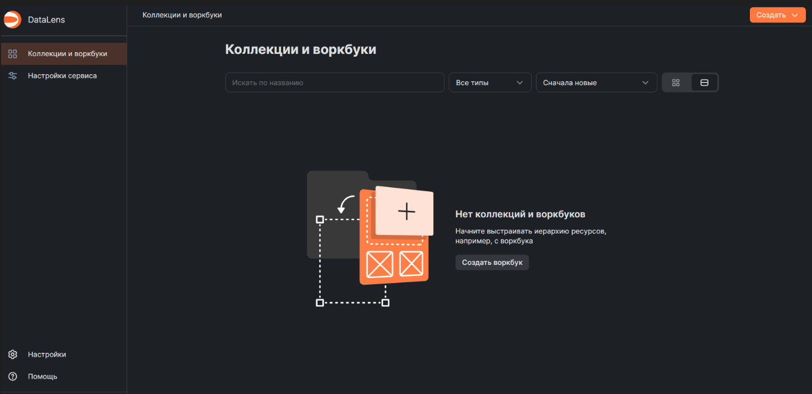
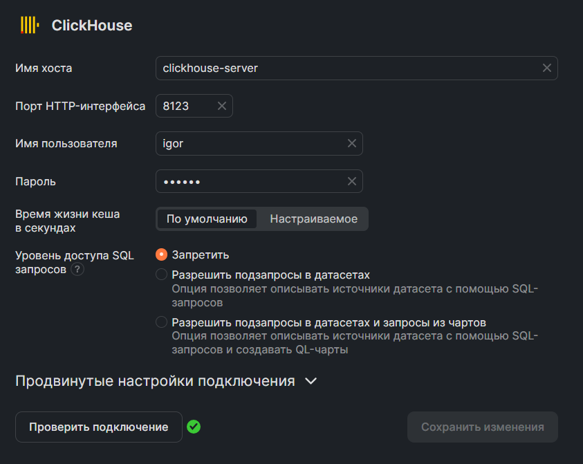
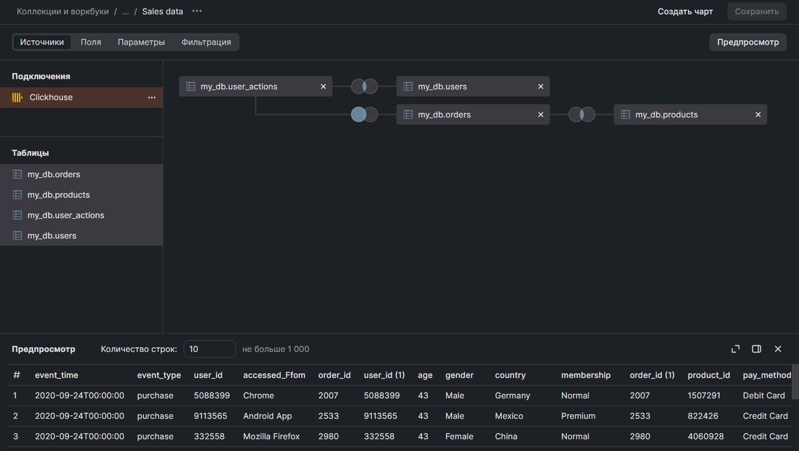
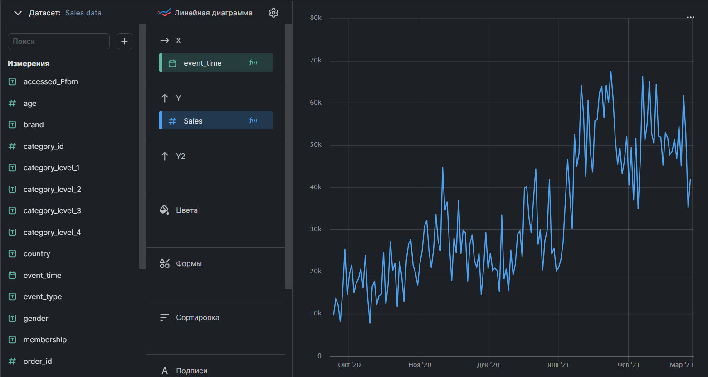

# Цель работы

У нас есть логи посетителей интернет магазина. <br> 
Наша задача - преобразовать их в удобный вид, поместить в базу данных и создать по ним дашборд с основными показателями этого магазина. <br> Поднимать базу данных будем с помощью докера <br>
База данных: Clickhouse <br>
BI-система : Yandex Datalens <br>
Итоговый дашборд доступен по [ссылке](https://datalens.yandex/kh78hvzugxxw8)

## Содержание:
1. [Docker](#1)
1. [Подготовка данных](#2)
    1. [Структура БД](#2_1)
    1. [Парсинг](#2_2)
1. [Предобработка](#3)
    1. [Users](#3_1)
    1. [Products](#3_2)
    1. [User_actions](#3_3)
    1. [Orders](#3_4)
1. [Работа с БД](#4)
1. [Datalens](#5)
    1. [Настройка окружения](#3_1)
    1. [Дашборд](#3_2)


# Docker <a class="anchor" id="1"></a>

Для реализации проекта нам потребуется три 3 образа: jupyter-notebook, clickhouse и datalens <br>
Начнем с первых двух. Поднимать кликхаус и юпитер будем через docker-compose файл где и пропишем все основные параметры

Начнем с кликхауса

```docker
clickhouse:
    image: yandex/clickhouse-server
    restart: always
    container_name: clickhouse-server
    volumes:
      - data_dir:/var/lib/clickhouse
      - ./config.xml:/etc/clickhouse-server/config.d/config.xml # Файл конфигурации
    environment:
      CLICKHOUSE_USER: igor
      CLICKHOUSE_PASSWORD: secret
    ulimits:
      nofile: 262144 
    networks:
      - datalens_default
```

Тут мы прописываем само имя нашего контейнетра, путь к волюмам где будут храниться наши данные, а также параметры окружения в виде имени пользователя и пароля. Также все наши образы будут поключены к одной сети datalens_default, чтобы в будущем не было проблем с их взаимодействием

С юпитер ноутбуком ситуация похожая

 ```docker
 jupyter:
    container_name: my_notebook
    ports:
      - "8888:8888"
    volumes:
      - .:/home/jovyan/
    build:
      context: .
      dockerfile: Dockerfile
    environment:
    - JUPYTER_TOKEN=easy
    networks:
      - datalens_default
 ```

Только мы еще подключили порт для соединения + сам образ будет подниматься из отдельного докерфайла такого содержания:

```docker
FROM jupyter/datascience-notebook:r-4.0.3
RUN pip3 install clickhouse-connect
RUN export JUPYTER_RUNTIME_DIR="./.jupyter_runtime"
```

Тут мы дополнительно прописали команду  для установки нужной библиотеки для подключения к кликхаусу и команду для избежания некоторых ошибок

Пока с докером все, прописываем команду "docker-compose up -d" и идем обрабатывать данные

# Предобработка данных <a class="anchor" id="2"></a>

## Структура БД <a class="anchor" id="2_1"></a>


```python
import requests
from bs4 import BeautifulSoup
import pandas as pd
import clickhouse_connect
import numpy as np
```


```python
df = pd.read_csv('raw_logs.csv')
```


```python
df.head()
```


<div>
<style scoped>
    .dataframe tbody tr th:only-of-type {
        vertical-align: middle;
    }

    .dataframe tbody tr th {
        vertical-align: top;
    }

    .dataframe thead th {
        text-align: right;
    }
</style>
<table border="1" class="dataframe">
  <thead>
    <tr style="text-align: right;">
      <th></th>
      <th>event_time</th>
      <th>event_type</th>
      <th>product_id</th>
      <th>category_id</th>
      <th>category_code</th>
      <th>brand</th>
      <th>price</th>
      <th>user_id</th>
      <th>accessed_Ffom</th>
      <th>age</th>
      <th>gender</th>
      <th>country</th>
      <th>membership</th>
      <th>returned</th>
      <th>pay_method</th>
      <th>order_id</th>
    </tr>
  </thead>
  <tbody>
    <tr>
      <th>0</th>
      <td>2020-09-24 11:57:06 UTC</td>
      <td>view</td>
      <td>1996170</td>
      <td>8452715</td>
      <td>electronics.telephone</td>
      <td>NaN</td>
      <td>31.90</td>
      <td>3034812</td>
      <td>Chrome</td>
      <td>23</td>
      <td>Male</td>
      <td>US</td>
      <td>Premium</td>
      <td>No</td>
      <td>Cash</td>
      <td>0</td>
    </tr>
    <tr>
      <th>1</th>
      <td>2020-10-23 05:30:06 UTC</td>
      <td>view</td>
      <td>1785245</td>
      <td>1480748</td>
      <td>stationery.cartrige</td>
      <td>canon</td>
      <td>43.11</td>
      <td>3034812</td>
      <td>Chrome</td>
      <td>23</td>
      <td>Male</td>
      <td>US</td>
      <td>Premium</td>
      <td>No</td>
      <td>Cash</td>
      <td>0</td>
    </tr>
    <tr>
      <th>2</th>
      <td>2020-12-12 16:13:11 UTC</td>
      <td>cart</td>
      <td>1443968</td>
      <td>9479855</td>
      <td>electronics.telephone</td>
      <td>sirius</td>
      <td>9.83</td>
      <td>3034812</td>
      <td>Chrome</td>
      <td>23</td>
      <td>Male</td>
      <td>US</td>
      <td>Premium</td>
      <td>No</td>
      <td>Cash</td>
      <td>0</td>
    </tr>
    <tr>
      <th>3</th>
      <td>2021-01-29 22:43:00 UTC</td>
      <td>view</td>
      <td>4079061</td>
      <td>7789416</td>
      <td>computers.components.videocards</td>
      <td>powercolor</td>
      <td>399.48</td>
      <td>3034812</td>
      <td>Chrome</td>
      <td>23</td>
      <td>Male</td>
      <td>US</td>
      <td>Premium</td>
      <td>No</td>
      <td>Cash</td>
      <td>0</td>
    </tr>
    <tr>
      <th>4</th>
      <td>2020-09-24 11:57:26 UTC</td>
      <td>view</td>
      <td>139905</td>
      <td>2472027</td>
      <td>computers.components.cooler</td>
      <td>zalman</td>
      <td>17.16</td>
      <td>8870078</td>
      <td>Chrome</td>
      <td>52</td>
      <td>Male</td>
      <td>CN</td>
      <td>Normal</td>
      <td>No</td>
      <td>Others</td>
      <td>0</td>
    </tr>
  </tbody>
</table>
</div>


Посмотрим на количество данных


```python
df.shape
```


    (903103, 16)


Немало, для удобства разделим все данные на таблицы по следующей схеме


Сейчас ее и реализуем. <br>
Начнем с таблицы users


```python
users = df.loc[:,['user_id','age','gender','country','membership']]
```

Удалим возможные дубликаты


```python
users.drop_duplicates(subset='user_id',inplace=True)
```


```python
users.user_id.nunique()
```


    230341


```python
users.shape
```


    (230341, 5)


Отлично, посмотрим что получилось


```python
users.head()
```


<div>
<style scoped>
    .dataframe tbody tr th:only-of-type {
        vertical-align: middle;
    }

    .dataframe tbody tr th {
        vertical-align: top;
    }

    .dataframe thead th {
        text-align: right;
    }
</style>
<table border="1" class="dataframe">
  <thead>
    <tr style="text-align: right;">
      <th></th>
      <th>user_id</th>
      <th>age</th>
      <th>gender</th>
      <th>country</th>
      <th>membership</th>
    </tr>
  </thead>
  <tbody>
    <tr>
      <th>0</th>
      <td>3034812</td>
      <td>23</td>
      <td>Male</td>
      <td>US</td>
      <td>Premium</td>
    </tr>
    <tr>
      <th>4</th>
      <td>8870078</td>
      <td>52</td>
      <td>Male</td>
      <td>CN</td>
      <td>Normal</td>
    </tr>
    <tr>
      <th>8</th>
      <td>1376091</td>
      <td>NaN</td>
      <td>Unknown</td>
      <td>US</td>
      <td>Premium</td>
    </tr>
    <tr>
      <th>14</th>
      <td>1075108</td>
      <td>NaN</td>
      <td>Female</td>
      <td>CH</td>
      <td>Premium</td>
    </tr>
    <tr>
      <th>20</th>
      <td>7170390</td>
      <td>NaN</td>
      <td>Female</td>
      <td>US</td>
      <td>Premium</td>
    </tr>
  </tbody>
</table>
</div>


Так, тут есть проблема, страны названы не совсем понятными аббревиатурами. В следующем пункте исправим это, а пока идем дальше


```python
orders = df.loc[:,['order_id','product_id','pay_method','returned']]
```


```python
df.order_id.value_counts()
```


    0          865007
    3173459         1
    3173730         1
    3173927         1
    3174044         1
                ...  
    1582853         1
    1582922         1
    1583032         1
    1583114         1
    4753923         1
    Name: order_id, Length: 38097, dtype: int64


Видимо нули это действия где не был совершен заказ, стоит их убрать


```python
orders = orders[orders['order_id']!=0]
```

Тоже самое делаем с products


```python
products = df.loc[:,['product_id','category_id','category_code','brand','price']]
```


```python
products.drop_duplicates(subset='product_id',inplace=True)
```

Осталась только таблица с действиями, чтобы создать ее просто удалим из основного датафрейма лишние столбцы


```python
user_actions = df.drop(columns = ['product_id','category_id','category_code',
                   'brand','price','age','gender','country',
                   'membership','pay_method','returned']).copy()
```


```python
user_actions.head()
```


<div>
<style scoped>
    .dataframe tbody tr th:only-of-type {
        vertical-align: middle;
    }

    .dataframe tbody tr th {
        vertical-align: top;
    }

    .dataframe thead th {
        text-align: right;
    }
</style>
<table border="1" class="dataframe">
  <thead>
    <tr style="text-align: right;">
      <th></th>
      <th>event_time</th>
      <th>event_type</th>
      <th>user_id</th>
      <th>accessed_Ffom</th>
      <th>order_id</th>
    </tr>
  </thead>
  <tbody>
    <tr>
      <th>0</th>
      <td>2020-09-24 11:57:06 UTC</td>
      <td>view</td>
      <td>3034812</td>
      <td>Chrome</td>
      <td>0</td>
    </tr>
    <tr>
      <th>1</th>
      <td>2020-10-23 05:30:06 UTC</td>
      <td>view</td>
      <td>3034812</td>
      <td>Chrome</td>
      <td>0</td>
    </tr>
    <tr>
      <th>2</th>
      <td>2020-12-12 16:13:11 UTC</td>
      <td>cart</td>
      <td>3034812</td>
      <td>Chrome</td>
      <td>0</td>
    </tr>
    <tr>
      <th>3</th>
      <td>2021-01-29 22:43:00 UTC</td>
      <td>view</td>
      <td>3034812</td>
      <td>Chrome</td>
      <td>0</td>
    </tr>
    <tr>
      <th>4</th>
      <td>2020-09-24 11:57:26 UTC</td>
      <td>view</td>
      <td>8870078</td>
      <td>Chrome</td>
      <td>0</td>
    </tr>
  </tbody>
</table>
</div>


```python
orders.order_id.value_counts()
```


    1070       1
    3173459    1
    3173730    1
    3173927    1
    3174044    1
              ..
    1582853    1
    1582922    1
    1583032    1
    1583114    1
    4753923    1
    Name: order_id, Length: 38096, dtype: int64


## Парсинг <a class="anchor" id="2_2"></a>

Чтобы заменить аббревиатуры стран в таблице users на полные названия нужно спарсить из интернета полную таблицу с сокращениями. <br>
Для этого будем использовать библиотеки requests и BeatifulSoup


```python
url = 'https://www.artlebedev.ru/country-list/' # возьмем эту таблицу с сайта студии Артемия Лебедева
r = requests.get(url) # делаем запрос к сайту
soup = BeautifulSoup(r.text,'html.parser') # достаем весь html код
```


```python
table = soup.find('table') # находим тэг таблицы
```

Названия стран и аббревиатур находятся в тегах td, чтобы их достать нам нужно выбирать эти теги с нужным интервалом


```python
countr = table.find_all('td')[2::8]
```


```python
abbr = table.find_all('td')[3::8]
```


```python
countr[0], abbr[0]
```


    (<td>Abkhazia</td>, <td>AB</td>)


Отлично, все получилось, осталось только избавится он лишних знаков


```python
str(countr[0]).split('<')[1].split('>')[1]
```


    'Abkhazia'


```python
str(abbr[0]).split('<')[1].split('>')[1]
```


    'AB'


Будем помещать очищенные знаки в отдельные массивы


```python
col1 = [0 for _ in range(len(countr))]
col2 = [0 for _ in range(len(countr))]
for i in range(len(countr)):
    c = str(countr[i]).split('<')[1].split('>')[1]
    a = str(abbr[i]).split('<')[1].split('>')[1]
    col1[i] = c
    col2[i] = a
```


```python
col1[:4],col2[:4]
```


    (['Abkhazia', 'Australia', 'Austria', 'Azerbaijan'], ['AB', 'AU', 'AT', 'AZ'])


Теперь поместим полученные данные в датафрейм и соединим его с основной таблицей users


```python
df_ab = pd.DataFrame({'Full_name':col1,'country':col2})
```


```python
df_ab.head()
```


<div>
<style scoped>
    .dataframe tbody tr th:only-of-type {
        vertical-align: middle;
    }

    .dataframe tbody tr th {
        vertical-align: top;
    }

    .dataframe thead th {
        text-align: right;
    }
</style>
<table border="1" class="dataframe">
  <thead>
    <tr style="text-align: right;">
      <th></th>
      <th>Full_name</th>
      <th>country</th>
    </tr>
  </thead>
  <tbody>
    <tr>
      <th>0</th>
      <td>Abkhazia</td>
      <td>AB</td>
    </tr>
    <tr>
      <th>1</th>
      <td>Australia</td>
      <td>AU</td>
    </tr>
    <tr>
      <th>2</th>
      <td>Austria</td>
      <td>AT</td>
    </tr>
    <tr>
      <th>3</th>
      <td>Azerbaijan</td>
      <td>AZ</td>
    </tr>
    <tr>
      <th>4</th>
      <td>Albania</td>
      <td>AL</td>
    </tr>
  </tbody>
</table>
</div>


```python
was = users.shape[0]
```


```python
users = users.merge(df_ab,on='country')
users.head()
```


<div>
<style scoped>
    .dataframe tbody tr th:only-of-type {
        vertical-align: middle;
    }

    .dataframe tbody tr th {
        vertical-align: top;
    }

    .dataframe thead th {
        text-align: right;
    }
</style>
<table border="1" class="dataframe">
  <thead>
    <tr style="text-align: right;">
      <th></th>
      <th>user_id</th>
      <th>age</th>
      <th>gender</th>
      <th>country</th>
      <th>membership</th>
      <th>Full_name</th>
    </tr>
  </thead>
  <tbody>
    <tr>
      <th>0</th>
      <td>3034812</td>
      <td>23</td>
      <td>Male</td>
      <td>US</td>
      <td>Premium</td>
      <td>United States</td>
    </tr>
    <tr>
      <th>1</th>
      <td>1376091</td>
      <td>NaN</td>
      <td>Unknown</td>
      <td>US</td>
      <td>Premium</td>
      <td>United States</td>
    </tr>
    <tr>
      <th>2</th>
      <td>7170390</td>
      <td>NaN</td>
      <td>Female</td>
      <td>US</td>
      <td>Premium</td>
      <td>United States</td>
    </tr>
    <tr>
      <th>3</th>
      <td>3061938</td>
      <td>NaN</td>
      <td>Female</td>
      <td>US</td>
      <td>Premium</td>
      <td>United States</td>
    </tr>
    <tr>
      <th>4</th>
      <td>547325</td>
      <td>NaN</td>
      <td>Female</td>
      <td>US</td>
      <td>Normal</td>
      <td>United States</td>
    </tr>
  </tbody>
</table>
</div>


```python
users['country'] = users['Full_name']
users.drop(columns='Full_name',inplace=True)
```

Проверим что у нас никакие данные не потерялись


```python
was, users.shape[0]
```


    (230341, 230341)


Теперь, когда у нас данные в удобном формате, мы можем приступить к их форматированию.

# Предобработка <a class="anchor" id="3"></a>

Начнем как раз с таблицы users

## Users <a class="anchor" id="3_1"></a> 


```python
users.head()
```


<div>
<style scoped>
    .dataframe tbody tr th:only-of-type {
        vertical-align: middle;
    }

    .dataframe tbody tr th {
        vertical-align: top;
    }

    .dataframe thead th {
        text-align: right;
    }
</style>
<table border="1" class="dataframe">
  <thead>
    <tr style="text-align: right;">
      <th></th>
      <th>user_id</th>
      <th>age</th>
      <th>gender</th>
      <th>country</th>
      <th>membership</th>
    </tr>
  </thead>
  <tbody>
    <tr>
      <th>0</th>
      <td>3034812</td>
      <td>23</td>
      <td>Male</td>
      <td>United States</td>
      <td>Premium</td>
    </tr>
    <tr>
      <th>1</th>
      <td>1376091</td>
      <td>NaN</td>
      <td>Unknown</td>
      <td>United States</td>
      <td>Premium</td>
    </tr>
    <tr>
      <th>2</th>
      <td>7170390</td>
      <td>NaN</td>
      <td>Female</td>
      <td>United States</td>
      <td>Premium</td>
    </tr>
    <tr>
      <th>3</th>
      <td>3061938</td>
      <td>NaN</td>
      <td>Female</td>
      <td>United States</td>
      <td>Premium</td>
    </tr>
    <tr>
      <th>4</th>
      <td>547325</td>
      <td>NaN</td>
      <td>Female</td>
      <td>United States</td>
      <td>Normal</td>
    </tr>
  </tbody>
</table>
</div>


Видно что в возрасте много пропуском, посмотрим какие типы у наших переменных


```python
users.dtypes
```


    user_id        int64
    age           object
    gender        object
    country       object
    membership    object
    dtype: object


Возраст почему-то object, посмотрим какие там есть значения


```python
users.age.value_counts().head(10)
```


    --    19651
    37     2460
    22     2382
    43     2335
    64     2309
    40     2292
    67     2276
    26     2265
    61     2264
    30     2239
    Name: age, dtype: int64


Понятно. Заменим все строки на медиану возраста, для начала посчитаем ее


```python
arr = [] # будем сюа добавлять все числовые значения
for i in users.age.dropna().values:
    try:
        arr.append(int(i)) # пытаемся перевести значение в число
    except: # если не получается пропускаем его
        pass
med = int(np.median(arr))
```

Теперь напишем функцию которая будет делать почти тоже самое, но если возникла ошибка она будет возвращать медиану. Так мы избавимся и от пропусков, и от строк


```python
def check(x):
    try:
        return int(x)
    except:
        return med
users['age'] = users.age.apply(check)
```

Проверим результат


```python
users.isna().sum()
```


    user_id       0
    age           0
    gender        0
    country       0
    membership    0
    dtype: int64


```python
users.dtypes
```


    user_id        int64
    age            int64
    gender        object
    country       object
    membership    object
    dtype: object


Прекрасно, все сработало <br>
Перейдем к таблице products

## Products <a class="anchor" id="3_2"></a>

Действуем по той же схеме


```python
products.dtypes
```


    product_id         int64
    category_id        int64
    category_code     object
    brand             object
    price            float64
    dtype: object


Тут все нормально


```python
products.isna().sum()
```


    product_id           0
    category_id          0
    category_code    18856
    brand            16486
    price                0
    dtype: int64


Пропуски в брендах и категориях заменим на 'Unknown'


```python
products.category_code.fillna('Unknown',inplace=True)
products.brand.fillna('Unknown',inplace=True)
```


```python
products.head()
```


<div>
<style scoped>
    .dataframe tbody tr th:only-of-type {
        vertical-align: middle;
    }

    .dataframe tbody tr th {
        vertical-align: top;
    }

    .dataframe thead th {
        text-align: right;
    }
</style>
<table border="1" class="dataframe">
  <thead>
    <tr style="text-align: right;">
      <th></th>
      <th>product_id</th>
      <th>category_id</th>
      <th>category_code</th>
      <th>brand</th>
      <th>price</th>
    </tr>
  </thead>
  <tbody>
    <tr>
      <th>0</th>
      <td>1996170</td>
      <td>8452715</td>
      <td>electronics.telephone</td>
      <td>Unknown</td>
      <td>31.90</td>
    </tr>
    <tr>
      <th>1</th>
      <td>1785245</td>
      <td>1480748</td>
      <td>stationery.cartrige</td>
      <td>canon</td>
      <td>43.11</td>
    </tr>
    <tr>
      <th>2</th>
      <td>1443968</td>
      <td>9479855</td>
      <td>electronics.telephone</td>
      <td>sirius</td>
      <td>9.83</td>
    </tr>
    <tr>
      <th>3</th>
      <td>4079061</td>
      <td>7789416</td>
      <td>computers.components.videocards</td>
      <td>powercolor</td>
      <td>399.48</td>
    </tr>
    <tr>
      <th>4</th>
      <td>139905</td>
      <td>2472027</td>
      <td>computers.components.cooler</td>
      <td>zalman</td>
      <td>17.16</td>
    </tr>
  </tbody>
</table>
</div>


Приведем колонку category_code в более удобный вид


```python
products[['category_level_1','category_level_2', # разделим колонку по точкам на 4 отдельных колонки
     'category_level_3','category_level_4']] = products.category_code.str.split('.',expand=True).add_prefix('category_level_') 
```


```python
products.drop(columns='category_code',inplace = True) # этот столбец нам не понадобится
```


```python
products.isna().sum()
```


    product_id              0
    category_id             0
    brand                   0
    price                   0
    category_level_1        0
    category_level_2    18856
    category_level_3    35057
    category_level_4    53417
    dtype: int64


Заменим получившиеся пропуски на 'Not'


```python
products['category_level_2'].fillna('Not',inplace=True)
products['category_level_3'].fillna('Not',inplace=True)
products['category_level_4'].fillna('Not',inplace=True)
```


```python
products.isna().sum()
```


    product_id          0
    category_id         0
    brand               0
    price               0
    category_level_1    0
    category_level_2    0
    category_level_3    0
    category_level_4    0
    dtype: int64


```python
products.head()
```


<div>
<style scoped>
    .dataframe tbody tr th:only-of-type {
        vertical-align: middle;
    }

    .dataframe tbody tr th {
        vertical-align: top;
    }

    .dataframe thead th {
        text-align: right;
    }
</style>
<table border="1" class="dataframe">
  <thead>
    <tr style="text-align: right;">
      <th></th>
      <th>product_id</th>
      <th>category_id</th>
      <th>category_code</th>
      <th>brand</th>
      <th>price</th>
      <th>category_level_1</th>
      <th>category_level_2</th>
      <th>category_level_3</th>
      <th>category_level_4</th>
    </tr>
  </thead>
  <tbody>
    <tr>
      <th>0</th>
      <td>1996170</td>
      <td>8452715</td>
      <td>electronics.telephone</td>
      <td>Unknown</td>
      <td>31.90</td>
      <td>electronics</td>
      <td>telephone</td>
      <td>Not</td>
      <td>Not</td>
    </tr>
    <tr>
      <th>1</th>
      <td>1785245</td>
      <td>1480748</td>
      <td>stationery.cartrige</td>
      <td>canon</td>
      <td>43.11</td>
      <td>stationery</td>
      <td>cartrige</td>
      <td>Not</td>
      <td>Not</td>
    </tr>
    <tr>
      <th>2</th>
      <td>1443968</td>
      <td>9479855</td>
      <td>electronics.telephone</td>
      <td>sirius</td>
      <td>9.83</td>
      <td>electronics</td>
      <td>telephone</td>
      <td>Not</td>
      <td>Not</td>
    </tr>
    <tr>
      <th>3</th>
      <td>4079061</td>
      <td>7789416</td>
      <td>computers.components.videocards</td>
      <td>powercolor</td>
      <td>399.48</td>
      <td>computers</td>
      <td>components</td>
      <td>videocards</td>
      <td>Not</td>
    </tr>
    <tr>
      <th>4</th>
      <td>139905</td>
      <td>2472027</td>
      <td>computers.components.cooler</td>
      <td>zalman</td>
      <td>17.16</td>
      <td>computers</td>
      <td>components</td>
      <td>cooler</td>
      <td>Not</td>
    </tr>
  </tbody>
</table>
</div>


## User_actions <a class="anchor" id="3_3"></a>


```python
user_actions.head()
```


<div>
<style scoped>
    .dataframe tbody tr th:only-of-type {
        vertical-align: middle;
    }

    .dataframe tbody tr th {
        vertical-align: top;
    }

    .dataframe thead th {
        text-align: right;
    }
</style>
<table border="1" class="dataframe">
  <thead>
    <tr style="text-align: right;">
      <th></th>
      <th>event_time</th>
      <th>event_type</th>
      <th>user_id</th>
      <th>accessed_Ffom</th>
      <th>order_id</th>
    </tr>
  </thead>
  <tbody>
    <tr>
      <th>0</th>
      <td>2020-09-24 11:57:06 UTC</td>
      <td>view</td>
      <td>3034812</td>
      <td>Chrome</td>
      <td>0</td>
    </tr>
    <tr>
      <th>1</th>
      <td>2020-10-23 05:30:06 UTC</td>
      <td>view</td>
      <td>3034812</td>
      <td>Chrome</td>
      <td>0</td>
    </tr>
    <tr>
      <th>2</th>
      <td>2020-12-12 16:13:11 UTC</td>
      <td>cart</td>
      <td>3034812</td>
      <td>Chrome</td>
      <td>0</td>
    </tr>
    <tr>
      <th>3</th>
      <td>2021-01-29 22:43:00 UTC</td>
      <td>view</td>
      <td>3034812</td>
      <td>Chrome</td>
      <td>0</td>
    </tr>
    <tr>
      <th>4</th>
      <td>2020-09-24 11:57:26 UTC</td>
      <td>view</td>
      <td>8870078</td>
      <td>Chrome</td>
      <td>0</td>
    </tr>
  </tbody>
</table>
</div>


Сократим event_time просто до даты


```python
user_actions.event_time=pd.to_datetime(df.event_time.apply(lambda x: x[:10]))
```


```python
user_actions.dtypes
```


    event_time       datetime64[ns]
    event_type               object
    user_id                   int64
    accessed_Ffom            object
    order_id                  int64
    dtype: object


C типами данных все нормально


```python
user_actions.head()
```


<div>
<style scoped>
    .dataframe tbody tr th:only-of-type {
        vertical-align: middle;
    }

    .dataframe tbody tr th {
        vertical-align: top;
    }

    .dataframe thead th {
        text-align: right;
    }
</style>
<table border="1" class="dataframe">
  <thead>
    <tr style="text-align: right;">
      <th></th>
      <th>event_time</th>
      <th>event_type</th>
      <th>user_id</th>
      <th>accessed_Ffom</th>
      <th>order_id</th>
    </tr>
  </thead>
  <tbody>
    <tr>
      <th>0</th>
      <td>2020-09-24</td>
      <td>view</td>
      <td>3034812</td>
      <td>Chrome</td>
      <td>0</td>
    </tr>
    <tr>
      <th>1</th>
      <td>2020-10-23</td>
      <td>view</td>
      <td>3034812</td>
      <td>Chrome</td>
      <td>0</td>
    </tr>
    <tr>
      <th>2</th>
      <td>2020-12-12</td>
      <td>cart</td>
      <td>3034812</td>
      <td>Chrome</td>
      <td>0</td>
    </tr>
    <tr>
      <th>3</th>
      <td>2021-01-29</td>
      <td>view</td>
      <td>3034812</td>
      <td>Chrome</td>
      <td>0</td>
    </tr>
    <tr>
      <th>4</th>
      <td>2020-09-24</td>
      <td>view</td>
      <td>8870078</td>
      <td>Chrome</td>
      <td>0</td>
    </tr>
  </tbody>
</table>
</div>


## Orders <a class="anchor" id="3_4"></a>


```python
orders.dtypes
```


    order_id       int64
    product_id     int64
    pay_method    object
    returned      object
    dtype: object


```python
orders.isna().sum()
```


    order_id      0
    product_id    0
    pay_method    0
    returned      0
    dtype: int64


Тут тоже все нормально, теперь перейдем к работе уже с кликхаусом

# Работа с БД <a class="anchor" id="4"></a>

Подключаемся к бд с помощью clickhouse_connect, вводим параметры которые задавали изначально в докере


```python
client = clickhouse_connect.get_client(host='clickhouse-server', port='8123', user='igor', password= 'secret')
```

Посмотрим проходят ли наши команды, создадим новую бд


```python
database = 'CREATE DATABASE IF NOT EXISTS my_db'
client.command(database)
```


    <clickhouse_connect.driver.summary.QuerySummary at 0x7fee8923e520>


Отлично, работает. Создадим нашу первую таблицу


```python
users.head()
```


<div>
<style scoped>
    .dataframe tbody tr th:only-of-type {
        vertical-align: middle;
    }

    .dataframe tbody tr th {
        vertical-align: top;
    }

    .dataframe thead th {
        text-align: right;
    }
</style>
<table border="1" class="dataframe">
  <thead>
    <tr style="text-align: right;">
      <th></th>
      <th>user_id</th>
      <th>age</th>
      <th>gender</th>
      <th>country</th>
      <th>membership</th>
    </tr>
  </thead>
  <tbody>
    <tr>
      <th>0</th>
      <td>3034812</td>
      <td>23</td>
      <td>Male</td>
      <td>United States</td>
      <td>Premium</td>
    </tr>
    <tr>
      <th>1</th>
      <td>1376091</td>
      <td>43</td>
      <td>Unknown</td>
      <td>United States</td>
      <td>Premium</td>
    </tr>
    <tr>
      <th>2</th>
      <td>7170390</td>
      <td>43</td>
      <td>Female</td>
      <td>United States</td>
      <td>Premium</td>
    </tr>
    <tr>
      <th>3</th>
      <td>3061938</td>
      <td>43</td>
      <td>Female</td>
      <td>United States</td>
      <td>Premium</td>
    </tr>
    <tr>
      <th>4</th>
      <td>547325</td>
      <td>43</td>
      <td>Female</td>
      <td>United States</td>
      <td>Normal</td>
    </tr>
  </tbody>
</table>
</div>


```python
client.command('DROP TABLE IF EXISTS my_db.users')
create_table_sql = '''
CREATE TABLE my_db.users (
user_id BIGINT,
age BIGINT, 
gender String, 
country String, 
membership String
) ENGINE = MergeTree()
ORDER BY (user_id)
'''
```


```python
client.command(create_table_sql)
client.insert_df('my_db.users',users)
```


    <clickhouse_connect.driver.summary.QuerySummary at 0x7feec12c76a0>


Проверим, проходят ли на запросы


```python
result_df = client.query_df('SELECT * FROM my_db.users')
result_df
```


<div>
<style scoped>
    .dataframe tbody tr th:only-of-type {
        vertical-align: middle;
    }

    .dataframe tbody tr th {
        vertical-align: top;
    }

    .dataframe thead th {
        text-align: right;
    }
</style>
<table border="1" class="dataframe">
  <thead>
    <tr style="text-align: right;">
      <th></th>
      <th>user_id</th>
      <th>age</th>
      <th>gender</th>
      <th>country</th>
      <th>membership</th>
    </tr>
  </thead>
  <tbody>
    <tr>
      <th>0</th>
      <td>4</td>
      <td>0</td>
      <td>Female</td>
      <td>United States</td>
      <td>Premium</td>
    </tr>
    <tr>
      <th>1</th>
      <td>24</td>
      <td>22</td>
      <td>Female</td>
      <td>Russian Federation</td>
      <td>Premium</td>
    </tr>
    <tr>
      <th>2</th>
      <td>42</td>
      <td>65</td>
      <td>Male</td>
      <td>Italy</td>
      <td>Premium</td>
    </tr>
    <tr>
      <th>3</th>
      <td>155</td>
      <td>0</td>
      <td>Female</td>
      <td>Italy</td>
      <td>Premium</td>
    </tr>
    <tr>
      <th>4</th>
      <td>166</td>
      <td>43</td>
      <td>Female</td>
      <td>Italy</td>
      <td>Premium</td>
    </tr>
    <tr>
      <th>...</th>
      <td>...</td>
      <td>...</td>
      <td>...</td>
      <td>...</td>
      <td>...</td>
    </tr>
    <tr>
      <th>230336</th>
      <td>9999868</td>
      <td>0</td>
      <td>Female</td>
      <td>Italy</td>
      <td>Premium</td>
    </tr>
    <tr>
      <th>230337</th>
      <td>9999869</td>
      <td>45</td>
      <td>Male</td>
      <td>Italy</td>
      <td>Premium</td>
    </tr>
    <tr>
      <th>230338</th>
      <td>9999913</td>
      <td>26</td>
      <td>Female</td>
      <td>Switzerland</td>
      <td>Normal</td>
    </tr>
    <tr>
      <th>230339</th>
      <td>9999924</td>
      <td>64</td>
      <td>Female</td>
      <td>Italy</td>
      <td>Normal</td>
    </tr>
    <tr>
      <th>230340</th>
      <td>9999940</td>
      <td>22</td>
      <td>Male</td>
      <td>Norway</td>
      <td>Premium</td>
    </tr>
  </tbody>
</table>
<p>230341 rows × 5 columns</p>
</div>


Прекрасно, аналогично вставляем остальные таблицы


```python
orders.head()
```


<div>
<style scoped>
    .dataframe tbody tr th:only-of-type {
        vertical-align: middle;
    }

    .dataframe tbody tr th {
        vertical-align: top;
    }

    .dataframe thead th {
        text-align: right;
    }
</style>
<table border="1" class="dataframe">
  <thead>
    <tr style="text-align: right;">
      <th></th>
      <th>order_id</th>
      <th>product_id</th>
      <th>pay_method</th>
      <th>returned</th>
    </tr>
  </thead>
  <tbody>
    <tr>
      <th>46</th>
      <td>1070</td>
      <td>1821557</td>
      <td>Credit Card</td>
      <td>No</td>
    </tr>
    <tr>
      <th>48</th>
      <td>1241</td>
      <td>3738555</td>
      <td>Credit Card</td>
      <td>No</td>
    </tr>
    <tr>
      <th>56</th>
      <td>1438</td>
      <td>1715916</td>
      <td>Cash</td>
      <td>No</td>
    </tr>
    <tr>
      <th>58</th>
      <td>1601</td>
      <td>1745899</td>
      <td>Debit Card</td>
      <td>No</td>
    </tr>
    <tr>
      <th>155</th>
      <td>1751</td>
      <td>809948</td>
      <td>Others</td>
      <td>No</td>
    </tr>
  </tbody>
</table>
</div>


```python
client.command('DROP TABLE IF EXISTS my_db.orders')
create_table_sql = '''
CREATE TABLE my_db.orders (
order_id BIGINT, 
product_id BIGINT,
pay_method String, 
returned String
) ENGINE = MergeTree()
ORDER BY (order_id)
'''
```


```python
client.command(create_table_sql)
client.insert_df('my_db.orders',orders)
```


    <clickhouse_connect.driver.summary.QuerySummary at 0x7feec12c2490>


```python
user_actions.head()
```


<div>
<style scoped>
    .dataframe tbody tr th:only-of-type {
        vertical-align: middle;
    }

    .dataframe tbody tr th {
        vertical-align: top;
    }

    .dataframe thead th {
        text-align: right;
    }
</style>
<table border="1" class="dataframe">
  <thead>
    <tr style="text-align: right;">
      <th></th>
      <th>event_time</th>
      <th>event_type</th>
      <th>user_id</th>
      <th>accessed_Ffom</th>
      <th>order_id</th>
    </tr>
  </thead>
  <tbody>
    <tr>
      <th>0</th>
      <td>2020-09-24</td>
      <td>view</td>
      <td>3034812</td>
      <td>Chrome</td>
      <td>0</td>
    </tr>
    <tr>
      <th>1</th>
      <td>2020-10-23</td>
      <td>view</td>
      <td>3034812</td>
      <td>Chrome</td>
      <td>0</td>
    </tr>
    <tr>
      <th>2</th>
      <td>2020-12-12</td>
      <td>cart</td>
      <td>3034812</td>
      <td>Chrome</td>
      <td>0</td>
    </tr>
    <tr>
      <th>3</th>
      <td>2021-01-29</td>
      <td>view</td>
      <td>3034812</td>
      <td>Chrome</td>
      <td>0</td>
    </tr>
    <tr>
      <th>4</th>
      <td>2020-09-24</td>
      <td>view</td>
      <td>8870078</td>
      <td>Chrome</td>
      <td>0</td>
    </tr>
  </tbody>
</table>
</div>


```python
client.command('DROP TABLE IF EXISTS my_db.user_actions')
create_table_sql = '''
CREATE TABLE my_db.logs (
event_time DATETIME,
event_type String,
user_id BIGINT,
accessed_Ffom String,
order_id BIGINT
) ENGINE = MergeTree()
ORDER BY (event_time)
'''
```


```python
client.command(create_table_sql)
client.insert_df('my_db.user_actions',user_actions)
```


    <clickhouse_connect.driver.summary.QuerySummary at 0x7feec12cc220>


```python
client.command('DROP TABLE IF EXISTS my_db.products')
create_table_sql = '''
CREATE TABLE my_db.products (
product_id Int64,
category_id Int64, 
brand String,
price Float32,
category_level_1 String,
category_level_2 String,
category_level_3 String,
category_level_4 String
) ENGINE = MergeTree()
ORDER BY (product_id)
'''
```


```python
client.command(create_table_sql)
client.insert_df('my_db.products',products)
```


    <clickhouse_connect.driver.summary.QuerySummary at 0x7fee7432c2b0>


```python
orders.head()
```


<div>
<style scoped>
    .dataframe tbody tr th:only-of-type {
        vertical-align: middle;
    }

    .dataframe tbody tr th {
        vertical-align: top;
    }

    .dataframe thead th {
        text-align: right;
    }
</style>
<table border="1" class="dataframe">
  <thead>
    <tr style="text-align: right;">
      <th></th>
      <th>order_id</th>
      <th>product_id</th>
      <th>pay_method</th>
      <th>returned</th>
    </tr>
  </thead>
  <tbody>
    <tr>
      <th>46</th>
      <td>1070</td>
      <td>1821557</td>
      <td>Credit Card</td>
      <td>No</td>
    </tr>
    <tr>
      <th>48</th>
      <td>1241</td>
      <td>3738555</td>
      <td>Credit Card</td>
      <td>No</td>
    </tr>
    <tr>
      <th>56</th>
      <td>1438</td>
      <td>1715916</td>
      <td>Cash</td>
      <td>No</td>
    </tr>
    <tr>
      <th>58</th>
      <td>1601</td>
      <td>1745899</td>
      <td>Debit Card</td>
      <td>No</td>
    </tr>
    <tr>
      <th>155</th>
      <td>1751</td>
      <td>809948</td>
      <td>Others</td>
      <td>No</td>
    </tr>
  </tbody>
</table>
</div>


Сделаем запрос, чтобы проверить как рабают связи между таблицами


```python
query = '''
SELECT event_time::date as date, COUNT(order_id) FILTER (WHERE returned='No') as orders
FROM my_db.logs JOIN my_db.orders 
USING(order_id)
GROUP BY event_time::date
'''
```


```python
result_df = client.query_df(query)
result_df.head()
```


<div>
<style scoped>
    .dataframe tbody tr th:only-of-type {
        vertical-align: middle;
    }

    .dataframe tbody tr th {
        vertical-align: top;
    }

    .dataframe thead th {
        text-align: right;
    }
</style>
<table border="1" class="dataframe">
  <thead>
    <tr style="text-align: right;">
      <th></th>
      <th>date</th>
      <th>orders</th>
    </tr>
  </thead>
  <tbody>
    <tr>
      <th>0</th>
      <td>2020-09-24</td>
      <td>81</td>
    </tr>
    <tr>
      <th>1</th>
      <td>2020-09-25</td>
      <td>149</td>
    </tr>
    <tr>
      <th>2</th>
      <td>2020-09-26</td>
      <td>123</td>
    </tr>
    <tr>
      <th>3</th>
      <td>2020-09-27</td>
      <td>111</td>
    </tr>
    <tr>
      <th>4</th>
      <td>2020-09-28</td>
      <td>189</td>
    </tr>
  </tbody>
</table>
</div>


Работает

# Datalens <a class="anchor" id="5"></a>

## Настройка окружения <a class="anchor" id="5_1"></a>

Теперя запустим сам Datalens, для нужно будет поднять уже его docker compose с помощью следующих команд

```docker 
cd datalens | спускаемся в папку даталенса
docker compose up -d | запускаем файл в пассивном режиме
```


Теперь по этому адресу http://localhost:8080 у нас должен открыться даталенс, сейча это и проверим



Все хорошо, проверим как работает наше подключение к кликхаусу



Теперь создадим датасет, где свяжем все наши таблицы



Попробуем построить первый чарт



Теперь, когда настройка закончена, можно переходить непосредственно к построению дашборда

## Дашборд <a class="anchor" id="5_2"></a>

Целью дашборда была визуализация основных показателей магазина <br>
В качестве ключевых метрик было решено выбрать: 
- общая выручка и по сегментам пользователей
- процент клиентов разного статуса и их количество по дням
- количество заказов
- средний чек
- обьем выручки по источникам трафика
- процент конверсии и его динамика
- процент возвратов и его динамика
- показатели выручки и количества заказов для каждой категории и бренда


Итоговый результат можно посмотреть по [ссылке](https://datalens.yandex/kh78hvzugxxw8)
