# Цель работы

У нас в распоряжении есть данные по продажам с 2012 по 2015 год

Наша задача - посчитать и проанализировать основные метрики магазина + дать рекомендации по дальнейшему развитию

## Содержание:
1. [Предобработка данных](#1)
1. [EDA](#2)
    1. [Общие тенденции](#2_1)
    1. [Основные показатели](#2_2)
1. [Когортный анализ](#3)
    1. [Retention](#3_1)
    1. [LTV](#3_2)
1. [RFM](#3)
1. [Результаты](#4)


# 1. Предобработка данных <a class="anchor" id="1"></a>


```python
import pandas as pd
import numpy as np
import matplotlib.pyplot as plt
import seaborn as sns
import scipy.stats as sts
import matplotlib.pyplot as plt
import squarify
```


```python
df = pd.read_csv("superstore.csv")
```


```python
df.head(3)
```


<div>
<style scoped>
    .dataframe tbody tr th:only-of-type {
        vertical-align: middle;
    }

    .dataframe tbody tr th {
        vertical-align: top;
    }

    .dataframe thead th {
        text-align: right;
    }
</style>
<table border="1" class="dataframe">
  <thead>
    <tr style="text-align: right;">
      <th></th>
      <th>Unnamed: 0</th>
      <th>Order ID</th>
      <th>Order Date</th>
      <th>Ship Date</th>
      <th>Ship Mode</th>
      <th>Customer ID</th>
      <th>Customer Name</th>
      <th>Segment</th>
      <th>City</th>
      <th>State</th>
      <th>...</th>
      <th>Product Name</th>
      <th>Sales</th>
      <th>Quantity</th>
      <th>Discount</th>
      <th>Profit</th>
      <th>Shipping Cost</th>
      <th>Order Priority</th>
      <th>Delivery Days</th>
      <th>order year</th>
      <th>order month</th>
    </tr>
  </thead>
  <tbody>
    <tr>
      <th>0</th>
      <td>0</td>
      <td>CA-2014-AB10015140-41954</td>
      <td>11-11-2014</td>
      <td>13-11-2014</td>
      <td>First Class</td>
      <td>AB-100151402</td>
      <td>Aaron Bergman</td>
      <td>Consumer</td>
      <td>Oklahoma City</td>
      <td>Oklahoma</td>
      <td>...</td>
      <td>Samsung Convoy 3</td>
      <td>221</td>
      <td>2</td>
      <td>0.0</td>
      <td>62</td>
      <td>40</td>
      <td>High</td>
      <td>2</td>
      <td>2014</td>
      <td>11</td>
    </tr>
    <tr>
      <th>1</th>
      <td>1</td>
      <td>IN-2014-JR162107-41675</td>
      <td>05-02-2014</td>
      <td>07-02-2014</td>
      <td>Second Class</td>
      <td>JR-162107</td>
      <td>Justin Ritter</td>
      <td>Corporate</td>
      <td>Wollongong</td>
      <td>New South Wales</td>
      <td>...</td>
      <td>Novimex Executive Leather Armchair, Black</td>
      <td>3709</td>
      <td>9</td>
      <td>0.1</td>
      <td>-288</td>
      <td>923</td>
      <td>Critical</td>
      <td>2</td>
      <td>2014</td>
      <td>2</td>
    </tr>
    <tr>
      <th>2</th>
      <td>2</td>
      <td>IN-2014-CR127307-41929</td>
      <td>17-10-2014</td>
      <td>18-10-2014</td>
      <td>First Class</td>
      <td>CR-127307</td>
      <td>Craig Reiter</td>
      <td>Consumer</td>
      <td>Brisbane</td>
      <td>Queensland</td>
      <td>...</td>
      <td>Nokia Smart Phone, with Caller ID</td>
      <td>5175</td>
      <td>9</td>
      <td>0.1</td>
      <td>919</td>
      <td>915</td>
      <td>Medium</td>
      <td>1</td>
      <td>2014</td>
      <td>10</td>
    </tr>
  </tbody>
</table>
<p>3 rows × 26 columns</p>
</div>


```python
df.shape
```


    (51290, 26)


```python
df.columns
```


    Index(['Unnamed: 0', 'Order ID', 'Order Date', 'Ship Date', 'Ship Mode',
           'Customer ID', 'Customer Name', 'Segment', 'City', 'State', 'Country',
           'Region', 'Market', 'Product ID', 'Category', 'Sub-Category',
           'Product Name', 'Sales', 'Quantity', 'Discount', 'Profit',
           'Shipping Cost', 'Order Priority', 'Delivery Days', 'order year',
           'order month'],
          dtype='object')


Удалим ненужные столбцы


```python
df.drop(columns = ['Unnamed: 0', 'Customer Name', 'Product ID'], inplace = True)
```

Посмотрим есть ли пропуски


```python
df.isna().sum()
```


    Order ID          0
    Order Date        0
    Ship Date         0
    Ship Mode         0
    Customer ID       0
    Segment           0
    City              0
    State             0
    Country           0
    Region            0
    Market            0
    Category          0
    Sub-Category      0
    Product Name      0
    Sales             0
    Quantity          0
    Discount          0
    Profit            0
    Shipping Cost     0
    Order Priority    0
    Delivery Days     0
    order year        0
    order month       0
    dtype: int64


## Дубликаты


```python
df[df.duplicated()]
```


<div>
<style scoped>
    .dataframe tbody tr th:only-of-type {
        vertical-align: middle;
    }

    .dataframe tbody tr th {
        vertical-align: top;
    }

    .dataframe thead th {
        text-align: right;
    }
</style>
<table border="1" class="dataframe">
  <thead>
    <tr style="text-align: right;">
      <th></th>
      <th>Order ID</th>
      <th>Order Date</th>
      <th>Ship Date</th>
      <th>Ship Mode</th>
      <th>Customer ID</th>
      <th>Segment</th>
      <th>City</th>
      <th>State</th>
      <th>Country</th>
      <th>Region</th>
      <th>...</th>
      <th>Product Name</th>
      <th>Sales</th>
      <th>Quantity</th>
      <th>Discount</th>
      <th>Profit</th>
      <th>Shipping Cost</th>
      <th>Order Priority</th>
      <th>Delivery Days</th>
      <th>order year</th>
      <th>order month</th>
    </tr>
  </thead>
  <tbody>
    <tr>
      <th>36524</th>
      <td>ES-2014-SR20740120-41804</td>
      <td>14-06-2014</td>
      <td>21-06-2014</td>
      <td>Standard Class</td>
      <td>SR-20740120</td>
      <td>Home Office</td>
      <td>Madrid</td>
      <td>Madrid</td>
      <td>Spain</td>
      <td>Southern Europe</td>
      <td>...</td>
      <td>Wilson Jones 3-Hole Punch, Economy</td>
      <td>83</td>
      <td>3</td>
      <td>0.0</td>
      <td>27</td>
      <td>3</td>
      <td>Medium</td>
      <td>7</td>
      <td>2014</td>
      <td>6</td>
    </tr>
    <tr>
      <th>39293</th>
      <td>KE-2014-PC900069-41693</td>
      <td>23-02-2014</td>
      <td>25-02-2014</td>
      <td>Second Class</td>
      <td>PC-900069</td>
      <td>Home Office</td>
      <td>Thika</td>
      <td>Central</td>
      <td>Kenya</td>
      <td>Eastern Africa</td>
      <td>...</td>
      <td>Cameo Business Envelopes, Set of 50</td>
      <td>20</td>
      <td>1</td>
      <td>0.0</td>
      <td>8</td>
      <td>2</td>
      <td>High</td>
      <td>2</td>
      <td>2014</td>
      <td>2</td>
    </tr>
    <tr>
      <th>45322</th>
      <td>ID-2012-AR105107-41031</td>
      <td>02-05-2012</td>
      <td>08-05-2012</td>
      <td>Standard Class</td>
      <td>AR-105107</td>
      <td>Consumer</td>
      <td>Armidale</td>
      <td>New South Wales</td>
      <td>Australia</td>
      <td>Oceania</td>
      <td>...</td>
      <td>Cardinal Hole Reinforcements, Recycled</td>
      <td>15</td>
      <td>3</td>
      <td>0.1</td>
      <td>2</td>
      <td>1</td>
      <td>Medium</td>
      <td>6</td>
      <td>2012</td>
      <td>5</td>
    </tr>
  </tbody>
</table>
<p>3 rows × 23 columns</p>
</div>


```python
df.drop_duplicates(inplace=True)
```

Посмотрим на типы данных


```python
df.dtypes
```


    Order ID           object
    Order Date         object
    Ship Date          object
    Ship Mode          object
    Customer ID        object
    Segment            object
    City               object
    State              object
    Country            object
    Region             object
    Market             object
    Category           object
    Sub-Category       object
    Product Name       object
    Sales               int64
    Quantity            int64
    Discount          float64
    Profit              int64
    Shipping Cost       int64
    Order Priority     object
    Delivery Days       int64
    order year          int64
    order month         int64
    dtype: object


```python
df['Order Date'] = pd.to_datetime(df['Order Date'],dayfirst=True)
df['Ship Date'] = pd.to_datetime(df['Ship Date'],dayfirst=True)
```


```python
df.dtypes
```


    Order ID                  object
    Order Date        datetime64[ns]
    Ship Date         datetime64[ns]
    Ship Mode                 object
    Customer ID               object
    Segment                   object
    City                      object
    State                     object
    Country                   object
    Region                    object
    Market                    object
    Category                  object
    Sub-Category              object
    Product Name              object
    Sales                      int64
    Quantity                   int64
    Discount                 float64
    Profit                     int64
    Shipping Cost              int64
    Order Priority            object
    Delivery Days              int64
    order year                 int64
    order month                int64
    dtype: object


# 2. EDA <a class="anchor" id="2"></a>

## Общие тенденции <a class="anchor" id="2_1"></a>


```python
df.head(3)
```


<div>
<style scoped>
    .dataframe tbody tr th:only-of-type {
        vertical-align: middle;
    }

    .dataframe tbody tr th {
        vertical-align: top;
    }

    .dataframe thead th {
        text-align: right;
    }
</style>
<table border="1" class="dataframe">
  <thead>
    <tr style="text-align: right;">
      <th></th>
      <th>Order ID</th>
      <th>Order Date</th>
      <th>Ship Date</th>
      <th>Ship Mode</th>
      <th>Customer ID</th>
      <th>Segment</th>
      <th>City</th>
      <th>State</th>
      <th>Country</th>
      <th>Region</th>
      <th>...</th>
      <th>Product Name</th>
      <th>Sales</th>
      <th>Quantity</th>
      <th>Discount</th>
      <th>Profit</th>
      <th>Shipping Cost</th>
      <th>Order Priority</th>
      <th>Delivery Days</th>
      <th>order year</th>
      <th>order month</th>
    </tr>
  </thead>
  <tbody>
    <tr>
      <th>0</th>
      <td>CA-2014-AB10015140-41954</td>
      <td>2014-11-11</td>
      <td>2014-11-13</td>
      <td>First Class</td>
      <td>AB-100151402</td>
      <td>Consumer</td>
      <td>Oklahoma City</td>
      <td>Oklahoma</td>
      <td>United States</td>
      <td>Central US</td>
      <td>...</td>
      <td>Samsung Convoy 3</td>
      <td>221</td>
      <td>2</td>
      <td>0.0</td>
      <td>62</td>
      <td>40</td>
      <td>High</td>
      <td>2</td>
      <td>2014</td>
      <td>11</td>
    </tr>
    <tr>
      <th>1</th>
      <td>IN-2014-JR162107-41675</td>
      <td>2014-02-05</td>
      <td>2014-02-07</td>
      <td>Second Class</td>
      <td>JR-162107</td>
      <td>Corporate</td>
      <td>Wollongong</td>
      <td>New South Wales</td>
      <td>Australia</td>
      <td>Oceania</td>
      <td>...</td>
      <td>Novimex Executive Leather Armchair, Black</td>
      <td>3709</td>
      <td>9</td>
      <td>0.1</td>
      <td>-288</td>
      <td>923</td>
      <td>Critical</td>
      <td>2</td>
      <td>2014</td>
      <td>2</td>
    </tr>
    <tr>
      <th>2</th>
      <td>IN-2014-CR127307-41929</td>
      <td>2014-10-17</td>
      <td>2014-10-18</td>
      <td>First Class</td>
      <td>CR-127307</td>
      <td>Consumer</td>
      <td>Brisbane</td>
      <td>Queensland</td>
      <td>Australia</td>
      <td>Oceania</td>
      <td>...</td>
      <td>Nokia Smart Phone, with Caller ID</td>
      <td>5175</td>
      <td>9</td>
      <td>0.1</td>
      <td>919</td>
      <td>915</td>
      <td>Medium</td>
      <td>1</td>
      <td>2014</td>
      <td>10</td>
    </tr>
  </tbody>
</table>
<p>3 rows × 23 columns</p>
</div>


Посчитаем обьем выручки по сегментам


```python
sns.set_theme()
rev_seg = df.groupby('Segment', as_index=False).sum('Sales')
sns.barplot(x = 'Segment', y = 'Sales', data = rev_seg)
```


    <AxesSubplot:xlabel='Segment', ylabel='Sales'>


    
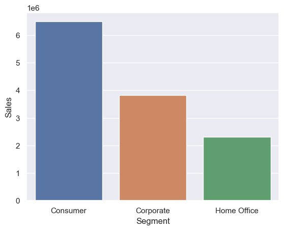
    


Магазин больше ориентируется на потребительский рынок <br>
Посмотрим на это в разрезе по городам


```python
sns.set(rc = {'figure.figsize':(12, 6)})
plt.xticks(rotation=45)
rev_city = df.groupby(['City','Segment'], as_index=False).sum('Sales').nlargest(15,columns='Sales')
sns.barplot(x = 'City', y = 'Sales', hue = 'Segment', data = rev_city)

```


    <AxesSubplot:xlabel='City', ylabel='Sales'>


    
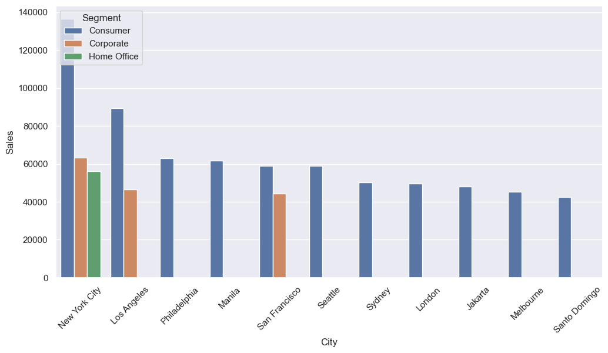
    


На первых местах города США, но дальше идет много городов Океании. Посмотрим на графике как распределеная выручка по регионам


```python
markets = df.groupby('Market', as_index=False).sum('Sales')
sns.barplot(x = 'Market', y = 'Sales', data = markets)
```


    <AxesSubplot:xlabel='Market', ylabel='Sales'>


    
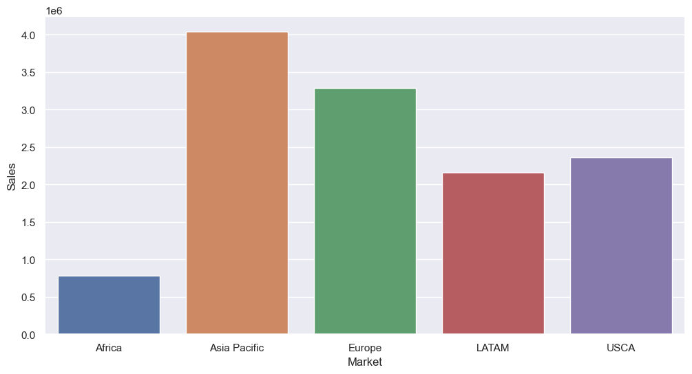
    


Интересно, значительную часть выручки магазин получает из Азиатско-Тихоакеанского региона.


```python
markets = df.groupby('Market', as_index=False).nunique('customer_id')
sns.barplot(x = 'Market', y = 'Sales', data = markets)
```


    <AxesSubplot:xlabel='Market', ylabel='Sales'>


    
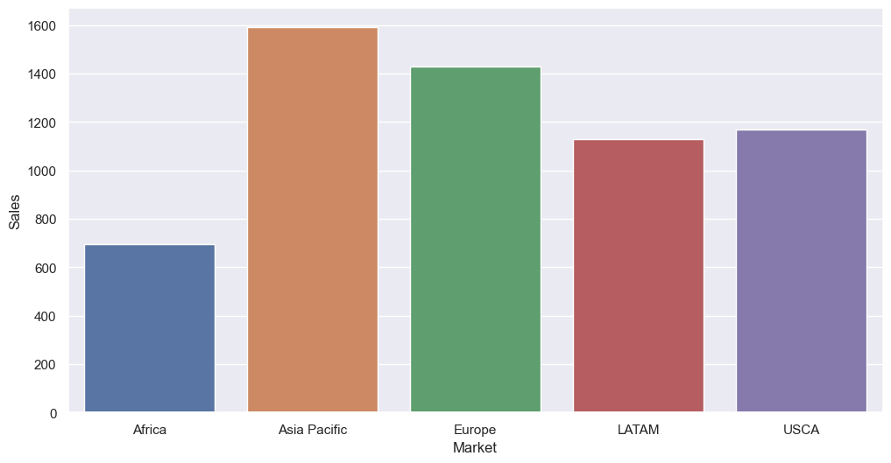
    


```python
markets = df.groupby('Country', as_index=False).sum('Sales').nlargest(5,'Sales')
sns.barplot(x = 'Country', y = 'Sales', data = markets)
```


    <AxesSubplot:xlabel='Country', ylabel='Sales'>


    
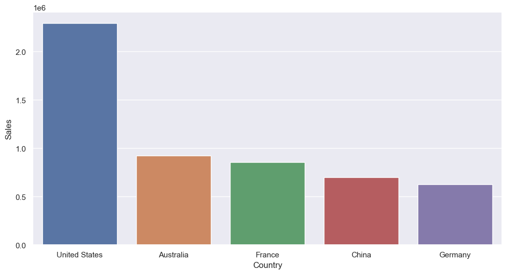
    


При группировке по странам на первом месте с большим отрывом штаты. 

Теперь посчитаем скорость доставки в зависимости от типа


```python
sns.set(rc = {'figure.figsize':(10, 3)})

sns.boxplot(x = 'Ship Mode', y = 'Delivery Days', data = df)

```


    <AxesSubplot:xlabel='Ship Mode', ylabel='Delivery Days'>


    
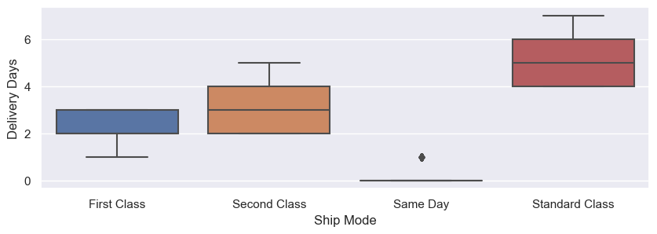
    


Видно, что все примерно соответствует названиям

Теперь перейдем к категориям


```python
sns.barplot(x = 'Category',y='Sales',
    data=df.groupby('Category',as_index=False)['Sales'].sum())
```


    <AxesSubplot:xlabel='Category', ylabel='Sales'>


    
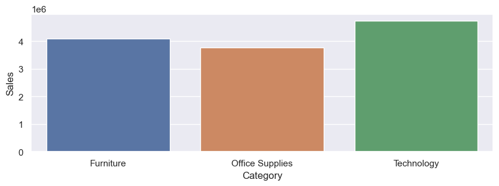
    


```python
sns.barplot(x = 'Sales',y='Sub-Category',
    data=df.groupby('Sub-Category',
                    as_index=False)['Sales'].sum().sort_values(by='Sales', ascending=False), orient='h')
```


    <AxesSubplot:xlabel='Sales', ylabel='Sub-Category'>


    
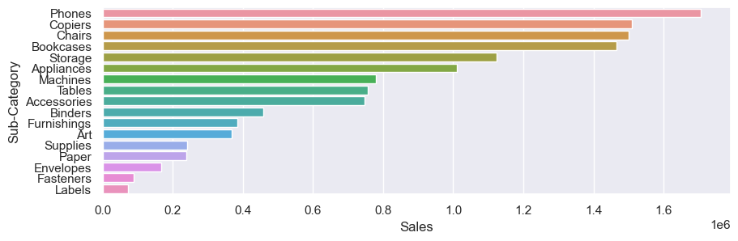
    


По выручке с открывом побеждают телефоны

## Основные показатели <a class="anchor" id="2_2"></a>


```python
df = df.sort_values(by='Order Date') # отсортируем данные по датам
```


```python
# сделаем основные временные промежутки группировки
df['date_month'] = df['Order Date'].dt.to_period('M').astype('datetime64')
df['date_year'] = df['Order Date'].dt.to_period('Y')
df['date_week'] = df['Order Date'].dt.to_period('W')
```

Сгруппируем выручку, прибыль, количество заказов и клиентов по годам


```python
years = df.groupby('date_year',
                    as_index=False).agg({'Sales':'sum','Profit':'sum',
                                                               'Order ID':'nunique','Customer ID':'nunique'})
```

Рассчитаем дополнительно средний чек и количество заказов на клиента


```python
years.columns = ['date_year','Sales','Profit', 'Orders','Clients']
years['Ord_per_client'] = round(years['Orders']/years['Clients'],2)
years['Check'] = round(years['Sales']/years['Orders'],2)

```


```python
years.head()
```


<div>
<style scoped>
    .dataframe tbody tr th:only-of-type {
        vertical-align: middle;
    }

    .dataframe tbody tr th {
        vertical-align: top;
    }

    .dataframe thead th {
        text-align: right;
    }
</style>
<table border="1" class="dataframe">
  <thead>
    <tr style="text-align: right;">
      <th></th>
      <th>date_year</th>
      <th>Sales</th>
      <th>Profit</th>
      <th>Orders</th>
      <th>Clients</th>
      <th>Ord_per_client</th>
      <th>Check</th>
    </tr>
  </thead>
  <tbody>
    <tr>
      <th>0</th>
      <td>2012</td>
      <td>2254748</td>
      <td>246688</td>
      <td>4515</td>
      <td>4164</td>
      <td>1.08</td>
      <td>499.39</td>
    </tr>
    <tr>
      <th>1</th>
      <td>2013</td>
      <td>2671783</td>
      <td>304664</td>
      <td>5473</td>
      <td>4949</td>
      <td>1.11</td>
      <td>488.18</td>
    </tr>
    <tr>
      <th>2</th>
      <td>2014</td>
      <td>3398568</td>
      <td>403408</td>
      <td>6883</td>
      <td>6113</td>
      <td>1.13</td>
      <td>493.76</td>
    </tr>
    <tr>
      <th>3</th>
      <td>2015</td>
      <td>4290805</td>
      <td>499839</td>
      <td>8857</td>
      <td>7624</td>
      <td>1.16</td>
      <td>484.45</td>
    </tr>
  </tbody>
</table>
</div>


Посмотрим на динамику показателей по годам


```python
fig, ax = plt.subplots(3,2,figsize = (15,7), sharex=True) # делаем общий график
y, x = 0, 0 # указываем координаты каждого графика

for i in years.columns[1:]:
    
    sns.barplot(x='date_year',y = i, data = years, ax = ax[y][x])
    ax[y][x].set_xlabel(None) # убираем подписи осей
    ax[y][x].set_ylabel(None)
    ax[y][x].set_title(i) # делаем имя
    x+=1
    if x == 2:
        y+=1
        x = 0


```


    
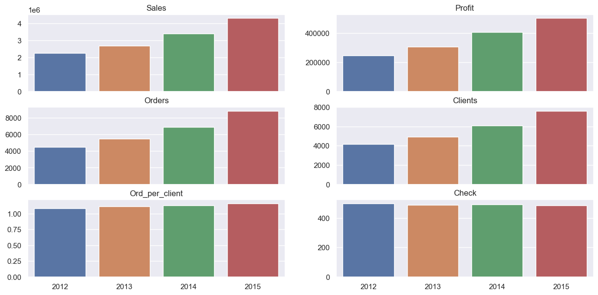
    


Тенденция хорошая. Вынесем показатели за последний год в виде текста


```python
def bold(text):
    return '\033[1m' + str(text) + '\033[0m'

a = list(years.iloc[-2:,:].values)
print(f'Общие показатели {a[1][0]} года:')
perc = []
for i in range(1,7):
    perc.append(bold(round((a[1][i]/a[0][i]-1)*100,2)))


print(f'Выручка - {bold(a[1][1])}, прирост отностельно прошлого года {perc[0]}%')
print(f'Прибыль - {bold(a[1][2])}, прирост отностельно прошлого года {perc[1]}%')
print(f'Количество заказов - {bold(a[1][3])}, прирост отностельно прошлого года {perc[2]}%')
print(f'Уникальных клиентов - {bold(a[1][4])}, прирост отностельно прошлого года {perc[3]}%')
print(f'Количество заказов на человека - {bold(a[1][5])}, прирост отностельно прошлого года {perc[4]}%')
print(f'Средний чек - {bold(a[1][6])}, прирост отностельно прошлого года {perc[5]}%')

```

    Общие показатели 2015 года:
    Выручка - 4290805, прирост отностельно прошлого года 26.25%
    Прибыль - 499839, прирост отностельно прошлого года 23.9%
    Количество заказов - 8857, прирост отностельно прошлого года 28.68%
    Уникальных клиентов - 7624, прирост отностельно прошлого года 24.72%
    Количество заказов на человека - 1.16, прирост отностельно прошлого года 2.65%
    Средний чек - 484.45, прирост отностельно прошлого года -1.89%
    

Из примечательного, больше одного заказа за год практически не заказывают


```python
months = df.groupby(['date_year','date_month'], as_index=False ).agg({'Sales':'sum','Profit':'sum','Order ID':'nunique','Customer ID':'nunique'})
```


```python
months.columns = ['date_year','date_month','Sales','Profit', 'Orders','Clients']
```


```python
months['Ord_per_client'] = round(months['Orders']/months['Clients'],2)
months['mean_check'] = round(months.Sales/months.Orders)
```


```python
months.head(3)
```


<div>
<style scoped>
    .dataframe tbody tr th:only-of-type {
        vertical-align: middle;
    }

    .dataframe tbody tr th {
        vertical-align: top;
    }

    .dataframe thead th {
        text-align: right;
    }
</style>
<table border="1" class="dataframe">
  <thead>
    <tr style="text-align: right;">
      <th></th>
      <th>date_year</th>
      <th>date_month</th>
      <th>Sales</th>
      <th>Profit</th>
      <th>Orders</th>
      <th>Clients</th>
      <th>Ord_per_client</th>
      <th>mean_check</th>
    </tr>
  </thead>
  <tbody>
    <tr>
      <th>0</th>
      <td>2012</td>
      <td>2012-01-01</td>
      <td>98666</td>
      <td>8224</td>
      <td>216</td>
      <td>215</td>
      <td>1.0</td>
      <td>457.0</td>
    </tr>
    <tr>
      <th>1</th>
      <td>2012</td>
      <td>2012-02-01</td>
      <td>103493</td>
      <td>14216</td>
      <td>203</td>
      <td>202</td>
      <td>1.0</td>
      <td>510.0</td>
    </tr>
    <tr>
      <th>2</th>
      <td>2012</td>
      <td>2012-03-01</td>
      <td>135475</td>
      <td>12952</td>
      <td>266</td>
      <td>266</td>
      <td>1.0</td>
      <td>509.0</td>
    </tr>
  </tbody>
</table>
</div>


```python
means = months.groupby('date_year',as_index=False).mean().round(2)
```


```python
means.head()
```


<div>
<style scoped>
    .dataframe tbody tr th:only-of-type {
        vertical-align: middle;
    }

    .dataframe tbody tr th {
        vertical-align: top;
    }

    .dataframe thead th {
        text-align: right;
    }
</style>
<table border="1" class="dataframe">
  <thead>
    <tr style="text-align: right;">
      <th></th>
      <th>date_year</th>
      <th>Sales</th>
      <th>Profit</th>
      <th>Orders</th>
      <th>Clients</th>
      <th>Ord_per_client</th>
      <th>mean_check</th>
    </tr>
  </thead>
  <tbody>
    <tr>
      <th>0</th>
      <td>2012</td>
      <td>187896.92</td>
      <td>20557.50</td>
      <td>376.25</td>
      <td>373.50</td>
      <td>1.01</td>
      <td>492.50</td>
    </tr>
    <tr>
      <th>1</th>
      <td>2013</td>
      <td>222648.58</td>
      <td>25388.67</td>
      <td>456.08</td>
      <td>451.50</td>
      <td>1.01</td>
      <td>487.58</td>
    </tr>
    <tr>
      <th>2</th>
      <td>2014</td>
      <td>283222.58</td>
      <td>33620.25</td>
      <td>573.58</td>
      <td>568.08</td>
      <td>1.01</td>
      <td>499.17</td>
    </tr>
    <tr>
      <th>3</th>
      <td>2015</td>
      <td>357567.08</td>
      <td>41653.25</td>
      <td>738.08</td>
      <td>727.75</td>
      <td>1.01</td>
      <td>485.08</td>
    </tr>
  </tbody>
</table>
</div>


```python
fig, ax = plt.subplots(3,2,figsize = (15,7), sharex=True)
y = 0
x = 0
for i in means.columns[1:]:
    
    sns.barplot(x='date_year',y = i, data = means, ax = ax[y][x])
    ax[y][x].set_xlabel(None)
    ax[y][x].set_ylabel(None)
    ax[y][x].set_title(i)
    x+=1
    if x == 2:
        y+=1
        x = 0
```


    
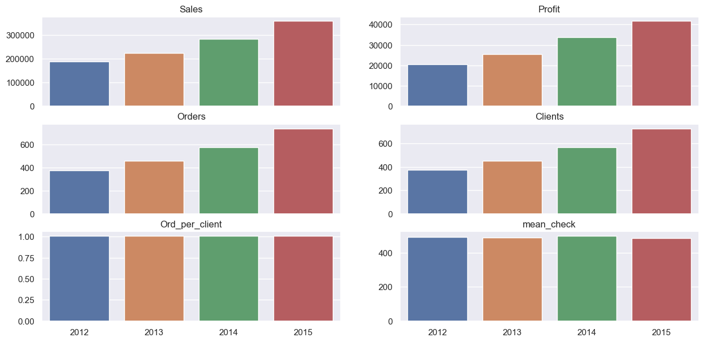
    


```python
a = list(means.iloc[-2:,:].values)
print(f'Месячные показатели за 2015 год:')
print(f'Среднее обьем выручки за месяц - {bold(a[1][1])}')
print(f'Средняя прибыль за месяц - {bold(a[1][2])}')
print(f'Среднее количество заказов за месяц - {bold(a[1][3])}')
print(f'Среднее количество клиентов за месяц - {bold(a[1][4])}')
print(f'Средний количество заказов на одного клиента - {bold(a[1][5])}')
print(f'Средний чек за месяц - {bold(a[1][6])}')

```

    Месячные показатели за 2015 год:
    Среднее обьем выручки за месяц - 357567.08
    Средняя прибыль за месяц - 41653.25
    Среднее количество заказов за месяц - 738.08
    Среднее количество клиентов за месяц - 727.75
    Средний количество заказов на одного клиента - 1.01
    Средний чек за месяц - 485.08
    

Построим линейные графики


```python
sns.set(rc = {'figure.figsize':(12, 3)})
sns.lineplot(x ='date_month', y = 'Clients', data = months)
plt.show()
sns.set(rc = {'figure.figsize':(12, 3)})
sns.lineplot(x ='date_month', y = 'Sales', data = months)
plt.show()
sns.set(rc = {'figure.figsize':(12, 3)})
sns.lineplot(x ='date_month', y = 'Profit', data = months)
plt.show()
```


    
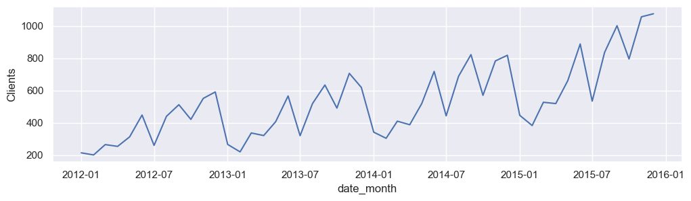
    


    
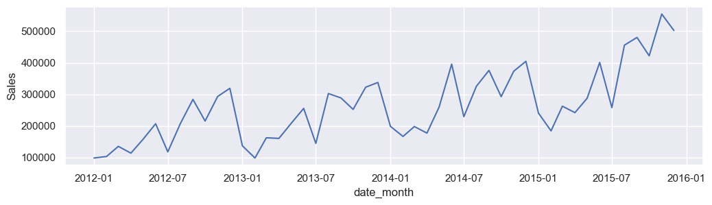
    


    
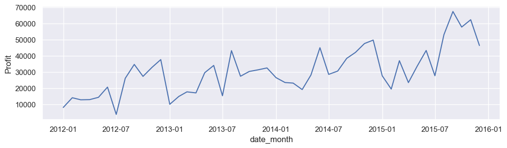
    


> У продаж и количества клиентов присутствует явная сезонность

Чтобы проверить это сравним на одном графике два последних года


```python
months['year'] = months['date_month'].dt.year
months['month'] = months['date_month'].dt.month
sns.set(rc = {'figure.figsize':(12, 3)})
compare = months.query('date_month>"2013-12"')[['Sales','year','month']]
sns.lineplot(data = compare, x = 'month', y = 'Sales', hue = 'year', palette=["C0", "C1"]) 
plt.show()

```


    
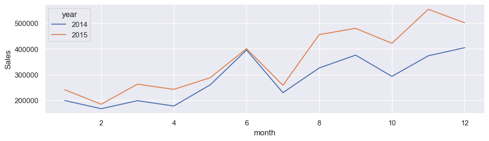
    


>Действиетльно,  у нас низкие продажи в начале года, но они постепенно растут, также спад продаж происходит в июле


```python
plt.xticks(rotation = 45)
sns.set(rc = {'figure.figsize':(15, 10)})
sns.lineplot(x = months.date_month, y = months['mean_check'])
```


    <AxesSubplot:xlabel='date_month', ylabel='mean_check'>


    
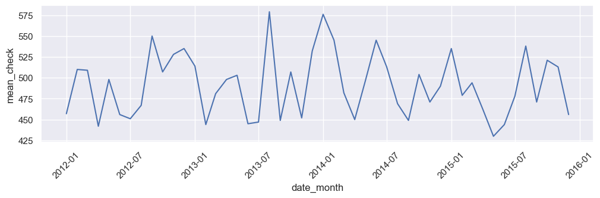
    


> Явно выраженной сезонности не заметно

# 3. Когортный анализ <a class="anchor" id="3"></a>

Разделим наших пользователей на группы по дате первой  покупки и посчитаем по ним Retention и LTV

## Retention <a class="anchor" id="3_1"></a>

Но сначала посмотрим на общую картину


```python
ret = df.groupby('Customer ID',as_index=False).agg({'Order ID':'nunique'})
gen_retention = ret[ret['Order ID']>1]['Customer ID'].count()/ret['Customer ID'].count()*100

```


```python
print(f'{round(gen_retention,2)}% пользователей совершает более одной покупки')
```

    31.21% пользователей совершает более одной покупки
    

Есть к чему стремится. Посчитаем как этот показатель ведет себя в динамике по годам


```python
first_sales= df.groupby('Customer ID',as_index=False).agg({'date_week':'min','date_month':'min', 'date_year':'min'}) # считаем первую неделю, месяц и год покупки
first_sales.columns = ['Customer ID','first_sale_week', 'first_sale_month','first_sale_year'] # переименовываем столбцы
df = df.merge(first_sales,on='Customer ID') # соединяем с основной таблицей
```


```python
gen_retention_years = df.groupby(['first_sale_year','Customer ID'],as_index=False)['Order ID'].nunique() # группируем по первому году и айдишнику, считаем количество заказов

gen_retention_years['Retention'] = gen_retention_years['Order ID']>1

gen_retention_years.groupby('first_sale_year').agg({'Retention': lambda x: round(x.sum()/x.count()*100,2), # считаем процент тех, кто заказывал болше 1-го раза
                                                    'Customer ID':'nunique'})
```


<div>
<style scoped>
    .dataframe tbody tr th:only-of-type {
        vertical-align: middle;
    }

    .dataframe tbody tr th {
        vertical-align: top;
    }

    .dataframe thead th {
        text-align: right;
    }
</style>
<table border="1" class="dataframe">
  <thead>
    <tr style="text-align: right;">
      <th></th>
      <th>Retention</th>
      <th>Customer ID</th>
    </tr>
    <tr>
      <th>first_sale_year</th>
      <th></th>
      <th></th>
    </tr>
  </thead>
  <tbody>
    <tr>
      <th>2012</th>
      <td>49.90</td>
      <td>4164</td>
    </tr>
    <tr>
      <th>2013</th>
      <td>40.20</td>
      <td>4197</td>
    </tr>
    <tr>
      <th>2014</th>
      <td>27.40</td>
      <td>4419</td>
    </tr>
    <tr>
      <th>2015</th>
      <td>9.92</td>
      <td>4635</td>
    </tr>
  </tbody>
</table>
</div>


> Тут уже интереснее. Показатель со временем убывает, что логично, так как для более молодых пользователей еще не прошло достаточное количество времени. <br> 

Теперь посчитаем возвращаемость для каждого года более подробно


```python
retention = df.pivot_table( # делаем сводную таблицу где строчки это первый год покупки, а столцы года покупок в общем
    index = 'first_sale_year',
    columns='date_year',
    values= 'Customer ID', # В качестве значений берем количество уникальных пользователей
    aggfunc = 'nunique'
)
```

Построим для визуализации тепловую карту


```python
sns.set(rc = {'figure.figsize':(8, 5)})
sns.heatmap(
    retention,
    annot=True,
    fmt='.0f',
    linewidths=1, 
    linecolor='black', 
    cmap="YlGnBu",
    vmax = 1100
)
```


    <AxesSubplot:xlabel='date_year', ylabel='first_sale_year'>


    
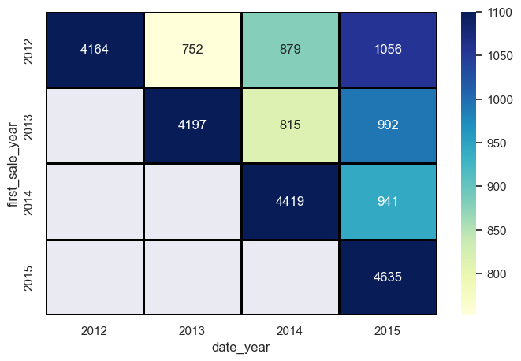
    


Для удобства перевем все в проценты


```python
rows = retention.values.diagonal() # берем количество новых пользователей за каждый год

for s,row in zip(rows, retention): 
    retention.loc[row] = retention.loc[row]/s # проходимся по каждой строчке и нормируем на изначаальное количество пользователей в этой когорте
    sns.set(rc = {'figure.figsize':(8, 5)})
    
sns.heatmap(
    retention,
    annot=True,
    fmt='.1%',
    linewidths=1, 
    linecolor='black', 
    cmap="YlGnBu",
    vmax=0.25
)
```


    <AxesSubplot:xlabel='date_year', ylabel='first_sale_year'>


    
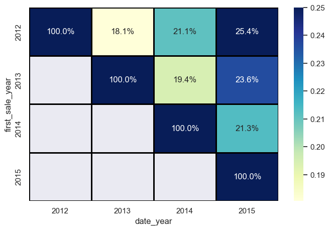
    


> Видны положительные тенденции. Ретеншн следующего года в более новых когортах выше, плюс в каждой когорте по отдельности ретеншн постепенно возрастает

Посмотрим как обстоят тела в разрезе по сегментам


```python
retention_years = df.pivot_table(
    index = ['first_sale_year','Segment'], # группируем по году и сегменту
    columns='date_year',
    values= 'Customer ID',
    aggfunc = 'nunique'
)
```


```python
row = 0
indx = np.array([])
for col in range(4):
    indx = np.concatenate((indx,retention_years.values[row:(row+3),col:(col+1)].flatten()), axis=0) # получаем значения первого года за каждый сектор
    row+=3


for s,row in zip(indx, range(12)):
    retention_years.iloc[row] = (retention_years.iloc[row]/s) # нормируем это все

sns.set(rc = {'figure.figsize':(8, 5)})
sns.heatmap( # строим график
    retention_years,
    annot=True,
    fmt='.1%',
    linewidths=1, 
    linecolor='black', 
    cmap="YlGnBu",
    vmax=0.27
)
```


    <AxesSubplot:xlabel='date_year', ylabel='first_sale_year-Segment'>


    
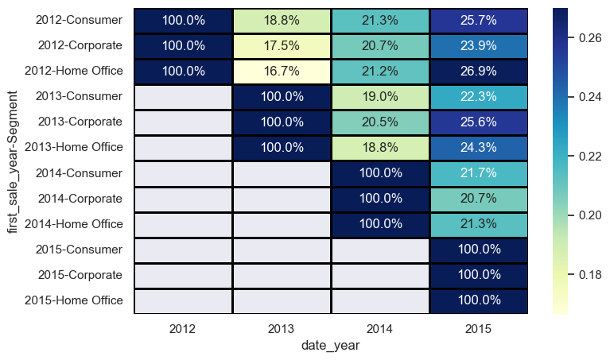
    


Тут в целов тенденции аналогичные. Теперь посчитаем LTV

## LTV <a class="anchor" id="3_2"></a>

Чтобы найти LTV нужно сначала посчитать прибыль за каждый год и количество уникальных ползователей, этим и займемся


```python
ltv_by_years = df.groupby(['first_sale_year','date_year'], as_index=False).agg({'Profit':'sum', # группируем данные по когортам и годам покупок
                                                  'Customer ID':'nunique'})    
                                                     
ltv_by_years['ltv'] = ltv_by_years['Profit']/ltv_by_years['Customer ID'] # считаем LTV по формуле
```

Создадим сводную таблицу и визуализацию для полученных значений


```python
pivot = ltv_by_years.pivot_table( 
    index = 'first_sale_year',
    columns='date_year', # в строках когорты, в столбцах года покупок
    values= 'ltv' # агрегация не понадобилась, росто выводим значения
)

sns.set(rc = {'figure.figsize':(15, 5)})
sns.heatmap(
    pivot,
    annot=True,
    fmt='.0f',
    linewidths=1, 
    linecolor='black', 
    cmap="YlGnBu"
)
```


    <AxesSubplot:xlabel='date_year', ylabel='first_sale_year'>


    
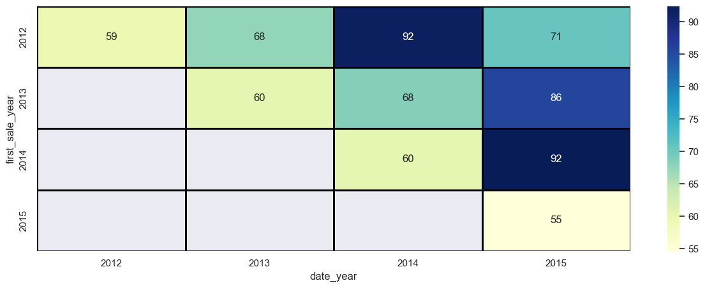
    


 > LTV первого года стоит на месте, неприятно. Видно, что LTV сильно возрастает через один год после покупки, возможно клиенты решают обновить телефоны/другую технику

Теперь нормируем эти показатели на retention


```python
pivot_ltv = retention*pivot

```


```python
sns.set(rc = {'figure.figsize':(15, 5)})
sns.heatmap(
    pivot_ltv,
    annot=True,
    fmt='.0f',
    linewidths=1, 
    linecolor='black', 
    cmap="YlGnBu"
)
```


    <AxesSubplot:xlabel='date_year', ylabel='first_sale_year'>


    
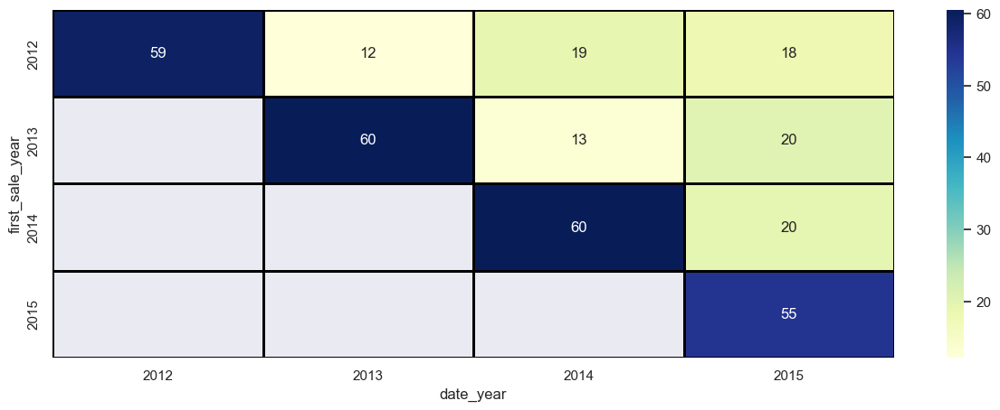
    


Из приятного, видно что LTV следующего года постепенно растет. <br>
Чтобы посчитать полное LTV для каждой когорты осталось вычислить кумулятивную сумму этих значений


```python
final_ltv = pivot_ltv.cumsum(axis=1)
sns.set(rc = {'figure.figsize':(15, 5)})
sns.heatmap(
    final_ltv,
    annot=True,
    fmt='.1f',
    linewidths=1, 
    linecolor='black', 
    cmap="YlGnBu"
)
```


    <AxesSubplot:xlabel='date_year', ylabel='first_sale_year'>


    
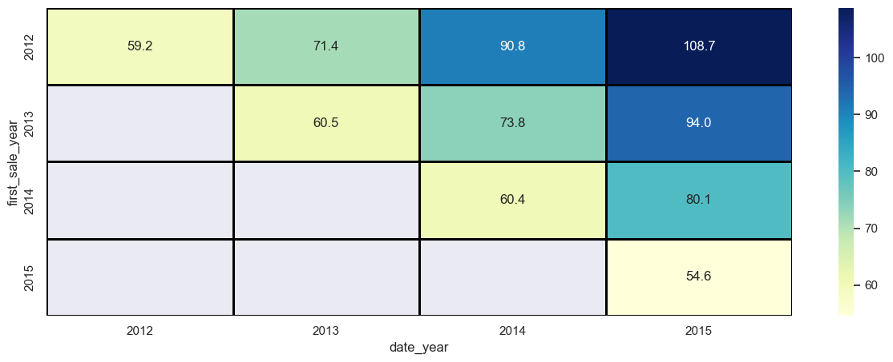
    


Теперь у нас есть LTV для каждой отдельной когорты. Проверим насколько правильно мы его посчитали


```python
gen_ltv = df.groupby('first_sale_year').agg({'Profit':'sum','Customer ID':'nunique'})   
gen_ltv['ltv'] = round(gen_ltv['Profit'] / gen_ltv['Customer ID'],2)
gen_ltv['ltv']
```


    first_sale_year
    2012    108.73
    2013     94.03
    2014     80.10
    2015     54.64
    Freq: A-DEC, Name: ltv, dtype: float64


Отлично, все совпало

Попробуем разделить наших клиентов уже по другим показателям с помощью RFM аналза

# 4. RFM <a class="anchor" id="4"></a>

Сначала выберем нужные столбцы


```python
rfm_df = df[['Customer ID','Order ID','Order Date','Sales']] 
```

Посчитаем нужные метрики для каждого клиента (как давно покупал, количество покупок, общая сумма)


```python
now = rfm_df['Order Date'].max() # находим самую последнюю дату в данных
rfm = (
    rfm_df.groupby('Customer ID') 
    .agg({
        'Order Date': lambda date: (now - date.max()).days, # считаем количество дней с последней покупки 
        'Order ID': 'count',                                    # число заказов
        'Sales': 'sum'                                      # суммарные траты
    })
)
```


```python
rfm.columns = ['recency', 'frequency', 'monetary'] # переименуем колонки
```

Посмотрим на гистограммы получившихся показателей


```python
rfm[['recency', 'monetary', 'frequency']].hist(figsize=(12,6), bins=30);
```


    
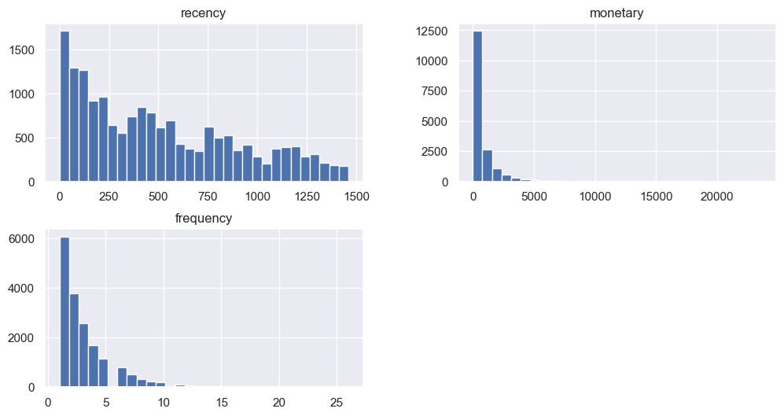
    


Все распределения экспоненциальные, а у частоты и суммы покупок присутствуют большие выбросы

Проведем сегментацию по каждому параметру с помощью квантилей


```python
rfm['r_quartile'] = pd.qcut(rfm['recency'].rank(method='first'), 4, labels = ['1','2','3','4']) # выбираем количество сегментов и метод ранжирования
rfm['f_quartile'] = pd.qcut(rfm['frequency'].rank(method='first'), 4, labels=['4','3','2','1'])
rfm['m_quartile'] = pd.qcut(rfm['monetary'].rank(method='first'), 4, labels = ['4','3','2','1'])
```

Совместим все полученные результаты в одну общую оценку


```python
rfm['RFM_Score'] = rfm.r_quartile.astype(str) + rfm.f_quartile.astype(str) + rfm.m_quartile.astype(str)
```


```python
rfm['RFM_Score'].nunique()
```


    64


У нас получилось 64 разных сегмента, но для более удобного анализа распределим их на схожие группы


```python
def clasify(x):
    if x == '111': # Постоянные клиенты, покупают много и часто
        return "Лучшие"
    elif x[0] in '12' and x[1] in '12' and x[2] in '12': # чуть хуже первых, но тоже хорошие
        return 'Лояльные постоянные'
    elif x[0] in '34' and x[1] in '12' and x[2] in '12': # раньше много и часто покупали, но уже давно у нас не бывали
        return "Требуют внимания"
    elif x[0] in '12' and x[1] =='4': # Недавно сделали первую покупку
        return "Недавние"
    elif x[0] == '4' and (x[1]=='4' or x[2]=='4'): # уже давно небыли и почти ничего не заказывали, возвращать смысла мало
        return "Потерянные"
    else:                                        # все остальные
        return "Обычные"
   
```


```python
rfm['group'] = rfm.RFM_Score.apply(clasify)
```

Сделаем наглядную визуализацию в виде древовидной карты


```python
y = rfm['group'].value_counts() # берем необходимые для графика значения
colors = ["#ffe046",'#c5ffaf','#ff8531',"#ed5041","#F6FDC3","#7dcc7f"] # ставим подходящие цвета

sns.set(rc = {'figure.figsize':(15, 8)})
squarify.plot(sizes=y.values,label = y.index, 
              color= colors,
              value = [str(round(i/rfm.shape[0]*100,2))+'%' for i in y.values])
```


    <AxesSubplot:>


    
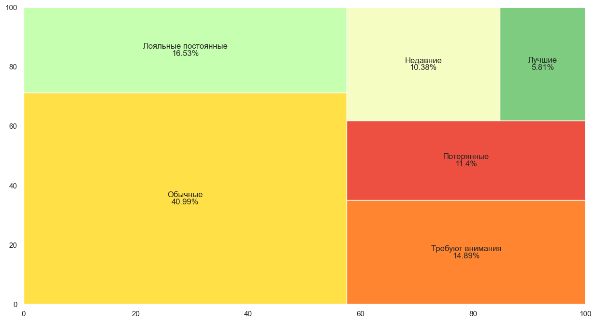
    


У нас есть довольно хороший костяк лояльной аудитории (22%) и вполне приемлемый процент "оттока" (11%)

# 5. Результаты <a class="anchor" id="5"></a>

##### Общие показатели


В ходе исследования бизнес-показателей Афиши за период с июня 2017 по конец мая 2018 года можно отметить следующее: - в основном компания работает на потребительский сектор.
Выручка и прибыль компании растут быстрыми темпами, в основном это происходит за счет увеличение клиентской базы, так как и средний чек и количество заказов на одного покупателя почти не меняются.
По выручке видна годовая сезонность, просадки наблюдаются в начале года и в середине лета, а достигают пиковых значений в июле и ближе к новому году. Это можно связать с подготовкой к праздникам и поиском отличных подарков. 
По итогам 2015 года на сайте ежемесячно совершали покупки 728 клиентов, ежемесячная прибыль составила 41653. В среднем один пользователь совершает 1.16 заказов за год

##### Retention
Процент пользователей совершавших повторые покупки упал с 50% в 2012 году до 10% в 2015. Из этого можно сделать вывод, что обычно клиент к нам возвращается раз в несколько лет. Тем не менее, за этот перод ретеншн следующего года вырос с 18% в 2012 году до 21% в 2014.

##### LTV
LTV первого года покупок остается практически неизменным на протяжении всего периода, что логично, так как срдений чек тоже не менятеся, однако LTV последующих лет постепено растет

##### RFM
По результатам RFM анализа удалось выделить следующие сегменты пользователей:
- Лучшие и лояльные пользователи (22%) - постоянные клиеты, составлющие ядро нашей аудитории.

-  Требующие внимания (15%) - пользователи, которые делали большие и частые покупки, но уже давно к нам не заходили. Их можно попробовать простимулировать рассылками, акциями, или пуш-уведовлениями.
- Потерянные (11%) - пользователи, которые покупали мало, не часто, и уже давно к нам не заходили. Пытаться вернуть скорее всего бесполезно
- Новички (10%) - клиенты, недавно совершившие первую покупку, можно пробовать взаимодействовать, чтобы повысить их шансы перехода в лояльную группу, предложить тематическую скидку, составить подборку рекомендованных товаров итд.
- Обычные (41%) - наша аудитория

#### Рекомандации
Основные показатели компании имеют довольно хорошую динамику, единственное, что стоит на месте это средний чек. Чтобы это исправить можно пробовать создать свою программу рояльности, делать специальные предложения и другие акции. Также хорошей идеей для стимулирования спроса может быть рассылка пуш уведомлений с персональными предложениями, начать можно с пользователей из группы "требуют внимания".


